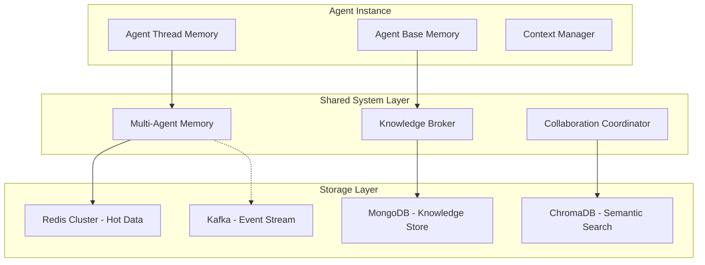

# SPADE_LLM Agent Memory Types: Implementation Evaluation

## Executive Summary

This document evaluates SPADE_LLM's current implementation and provides recommendations for three critical memory types: **Agent Thread Memory** (same-agent interactions), **Agent Base Memory** (individual agent knowledge), and **Multi-Agent System Memory** (shared knowledge across agents).

## Current State Analysis

### What Exists Today
- ✅ **Conversational Context**: Per-conversation message history via `ContextManager`
- ✅ **Message Threading**: Conversation isolation by ID
- ❌ **Agent Persistent Memory**: No agent-specific knowledge storage
- ❌ **Cross-Agent Memory**: No shared memory between agent instances
- ❌ **Thread Continuity**: Memory lost on agent restart

### Critical Gaps
1. **No Agent Identity Memory**: Each agent instance starts fresh
2. **No Inter-Agent Communication Memory**: Agents can't learn from each other
3. **No Thread Persistence**: Conversation threads don't survive restarts
4. **No Agent Specialization**: Agents can't accumulate domain expertise

## Memory Type 1: Agent Thread Memory (Same-Agent Interactions)

### Definition
Memory that maintains context and continuity across multiple conversation threads with the same agent instance, allowing for cross-thread learning and reference.

### Current Implementation Gap
```python
# Current: Isolated per conversation
class ContextManager:
    def __init__(self):
        self._conversations: Dict[str, List[ContextMessage]] = {}
        # Problem: No cross-thread memory or agent-level continuity

# Missing: Agent-level thread management
class AgentThreadMemory:  # NOT IMPLEMENTED
    def __init__(self, agent_id: str):
        self.agent_id = agent_id
        self.active_threads: Dict[str, ConversationThread] = {}
        self.thread_history: List[ThreadSummary] = []
        self.cross_thread_knowledge: SemanticMemory = {}
```

### Proposed Architecture

#### Data Structure Design
```python
@dataclass
class ConversationThread:
    thread_id: str
    agent_id: str
    participants: List[str]
    created_at: datetime
    last_active: datetime
    status: ThreadStatus  # ACTIVE, PAUSED, COMPLETED, ARCHIVED
    messages: List[ContextMessage]
    summary: Optional[str]
    key_outcomes: List[str]
    referenced_threads: List[str]  # Cross-thread references

@dataclass 
class ThreadMemory:
    agent_id: str
    threads: Dict[str, ConversationThread]
    thread_index: Dict[str, List[str]]  # Topic -> thread_ids
    cross_references: Dict[str, List[str]]  # thread_id -> related_threads
    learned_patterns: Dict[str, Any]  # Extracted knowledge
```

#### Storage Strategy Analysis

| Storage Option | Pros | Cons | Hot Path Impact | Recommendation |
|---------------|------|------|-----------------|----------------|
| **Redis Hash** | Fast access, thread isolation | Memory intensive, no semantic search | Minimal (<1ms) | ✅ Active threads |
| **PostgreSQL** | ACID compliance, complex queries | Higher latency, requires schema | Medium (10-50ms) | ✅ Thread archive |
| **ChromaDB** | Semantic search, thread similarity | Vector overhead, complex updates | High (50-200ms) | ✅ Knowledge extraction |

#### Hot Path vs Background Processing

**Hot Path Operations** (Synchronous):
```python
async def add_message_to_thread(self, thread_id: str, message: ContextMessage):
    # 1. Add to active thread cache (Redis) - <1ms
    await self.active_cache.append(thread_id, message)
    
    # 2. Update thread metadata - <5ms
    await self.update_thread_status(thread_id, last_active=datetime.now())
    
    # 3. Check for cross-thread references - <10ms
    if references := await self.detect_thread_references(message):
        await self.link_threads(thread_id, references)

async def get_thread_context(self, thread_id: str) -> List[ContextMessage]:
    # Fast path: Active thread cache
    if context := await self.active_cache.get(thread_id):
        return context
    # Fallback: Database retrieval with caching
    return await self.load_and_cache_thread(thread_id)
```

**Background Processing** (Asynchronous):
```python
async def background_thread_processing(self):
    while True:
        # 1. Thread summarization for inactive threads
        inactive_threads = await self.get_inactive_threads(hours=24)
        for thread in inactive_threads:
            summary = await self.summarize_thread(thread)
            await self.archive_thread_with_summary(thread.id, summary)
        
        # 2. Cross-thread pattern extraction
        await self.extract_cross_thread_patterns()
        
        # 3. Thread similarity indexing for recommendations
        await self.update_thread_similarity_index()
        
        await asyncio.sleep(300)  # Run every 5 minutes
```

#### Implementation Pros/Cons

**Pros:**
- Maintains conversation continuity across sessions
- Enables "Remember when we discussed..." functionality
- Supports complex multi-session projects
- Allows thread prioritization and organization

**Cons:**
- Increased memory footprint per agent
- Complex thread lifecycle management
- Potential for memory leaks with abandoned threads
- Cross-thread reference tracking complexity

#### Data Storage Recommendation
- **Primary**: Redis Cluster for active threads (fast access)
- **Secondary**: PostgreSQL for thread archive (complex queries)
- **Tertiary**: ChromaDB for semantic thread search

## Memory Type 2: Agent Base Memory (Individual Agent Knowledge)

### Definition
Persistent knowledge base specific to each agent instance, accumulating expertise, preferences, successful patterns, and learned behaviors over time.

### Current Implementation Gap
```python
# Current: No agent-specific persistent memory
class LLMAgent(Agent):
    def __init__(self, jid: str, password: str):
        # Problem: No persistent agent identity or knowledge
        self.context = ContextManager()  # Ephemeral only

# Missing: Agent knowledge persistence
class AgentBaseMemory:  # NOT IMPLEMENTED
    def __init__(self, agent_id: str):
        self.agent_id = agent_id
        self.expertise_domains: Dict[str, ExpertiseLevel] = {}
        self.successful_patterns: List[SuccessPattern] = []
        self.preferences: Dict[str, Any] = {}
        self.tool_performance: Dict[str, ToolMetrics] = {}
```

### Proposed Architecture

#### Data Structure Design
```python
@dataclass
class AgentIdentity:
    agent_id: str
    name: str
    specialization: List[str]
    created_at: datetime
    total_conversations: int
    success_rate: float
    expertise_level: Dict[str, float]  # domain -> expertise_score

@dataclass
class AgentKnowledge:
    agent_id: str
    facts: Dict[str, Fact]  # Learned facts with confidence scores
    patterns: Dict[str, Pattern]  # Successful interaction patterns
    preferences: UserPreferences  # User interaction preferences
    tool_expertise: Dict[str, ToolExpertise]  # Tool usage optimization
    domain_knowledge: Dict[str, DomainExpertise]  # Specialized knowledge

@dataclass
class Fact:
    content: str
    confidence: float
    source: str  # conversation_id or external source
    learned_at: datetime
    verified: bool
    usage_count: int

@dataclass
class Pattern:
    pattern_id: str
    description: str
    trigger_conditions: List[str]
    actions: List[str]
    success_rate: float
    usage_count: int
    last_used: datetime
```

#### Storage Strategy Analysis

| Storage Option | Pros | Cons | Hot Path Impact | Recommendation |
|---------------|------|------|-----------------|----------------|
| **Neo4j** | Graph relationships, complex queries | Learning curve, higher complexity | Medium (20-100ms) | ✅ Knowledge graphs |
| **SQLite per Agent** | Simple, file-based, ACID | Limited concurrency, no clustering | Low (5-20ms) | ✅ Local development |
| **MongoDB** | Document flexibility, easy scaling | No ACID guarantees, query complexity | Medium (10-50ms) | ✅ Production deployment |
| **Vector DB + Metadata** | Semantic search, similarity | Complex updates, vector overhead | High (50-200ms) | ✅ Knowledge retrieval |

#### Hot Path vs Background Processing

**Hot Path Operations** (Synchronous):
```python
async def get_agent_context(self, query: str) -> AgentContext:
    # 1. Retrieve relevant facts (semantic search) - <50ms
    relevant_facts = await self.knowledge_store.search_facts(
        agent_id=self.agent_id, 
        query=query, 
        limit=10
    )
    
    # 2. Get applicable patterns - <20ms
    patterns = await self.pattern_store.get_matching_patterns(
        agent_id=self.agent_id,
        context=query
    )
    
    # 3. Load user preferences - <10ms
    preferences = await self.preference_cache.get(self.agent_id)
    
    return AgentContext(facts=relevant_facts, patterns=patterns, preferences=preferences)

async def quick_fact_lookup(self, fact_key: str) -> Optional[Fact]:
    # Ultra-fast cached fact retrieval for hot path
    return await self.fact_cache.get(f"{self.agent_id}:{fact_key}")
```

**Background Processing** (Asynchronous):
```python
async def background_learning_process(self):
    while True:
        # 1. Extract new facts from recent conversations
        recent_conversations = await self.get_recent_conversations(hours=1)
        for conv in recent_conversations:
            facts = await self.extract_facts(conv)
            await self.store_facts_with_verification(facts)
        
        # 2. Pattern recognition and success rate updates
        await self.analyze_interaction_patterns()
        
        # 3. Knowledge graph updates and relationship building
        await self.update_knowledge_relationships()
        
        # 4. Expertise level recalculation
        await self.recalculate_expertise_scores()
        
        await asyncio.sleep(600)  # Run every 10 minutes
```

#### Implementation Pros/Cons

**Pros:**
- Agents become more effective over time
- Personalized responses based on accumulated knowledge
- Domain expertise development
- Tool usage optimization
- User preference learning

**Cons:**
- Complex knowledge extraction and validation
- Potential for knowledge drift or errors
- Privacy concerns with personal data storage
- Increased storage requirements per agent
- Knowledge consistency challenges

#### Data Storage Recommendation
- **Primary**: MongoDB for agent knowledge documents
- **Secondary**: Redis for frequently accessed facts/patterns
- **Tertiary**: ChromaDB for semantic knowledge search
- **Backup**: Neo4j for complex relationship queries

## Memory Type 3: Multi-Agent System Memory (Shared Knowledge)

### Definition
Shared memory pool accessible by multiple agents in the system, enabling knowledge transfer, collaboration patterns, and system-wide learning.

### Current Implementation Gap
```python
# Current: No inter-agent communication or shared memory
class LLMAgent(Agent):
    # Problem: Agents operate in isolation, no knowledge sharing
    async def send_message(self, to: str, message: str):
        # Basic XMPP messaging without memory integration

# Missing: Multi-agent memory coordination
class MultiAgentMemory:  # NOT IMPLEMENTED
    def __init__(self):
        self.shared_knowledge: SharedKnowledgeBase = {}
        self.collaboration_patterns: Dict[str, CollaborationPattern] = {}
        self.agent_network: Dict[str, List[str]] = {}  # Agent relationships
        self.system_insights: List[SystemInsight] = []
```

### Proposed Architecture

#### Data Structure Design
```python
@dataclass
class SharedKnowledge:
    knowledge_id: str
    content: str
    knowledge_type: KnowledgeType  # FACT, PATTERN, INSIGHT, PROCEDURE
    confidence: float
    contributing_agents: List[str]
    verification_count: int
    created_at: datetime
    last_updated: datetime
    access_count: int
    tags: List[str]

@dataclass
class CollaborationPattern:
    pattern_id: str
    participating_agents: List[str]
    interaction_type: InteractionType  # HANDOFF, PARALLEL, HIERARCHICAL
    success_rate: float
    average_completion_time: float
    typical_use_cases: List[str]
    required_capabilities: List[str]

@dataclass
class AgentNetwork:
    agent_id: str
    trusted_agents: List[str]  # Agents this agent trusts knowledge from
    collaboration_history: Dict[str, CollaborationHistory]
    expertise_awareness: Dict[str, List[str]]  # Other agents' expertise
    communication_patterns: Dict[str, CommunicationPreference]

@dataclass
class SystemInsight:
    insight_id: str
    description: str
    evidence: List[str]  # Supporting conversation/interaction IDs
    impact_score: float
    actionable_recommendations: List[str]
    affected_agents: List[str]
    generated_at: datetime
```

#### Storage Strategy Analysis

| Storage Option | Pros | Cons | Hot Path Impact | Recommendation |
|---------------|------|------|-----------------|----------------|
| **Redis Cluster** | Fast access, pub/sub, shared state | Memory intensive, limited querying | Minimal (<5ms) | ✅ Active shared state |
| **Distributed MongoDB** | Horizontal scaling, document flexibility | Eventual consistency, complexity | Medium (20-100ms) | ✅ Knowledge repository |
| **Apache Kafka** | Event streaming, real-time updates | Complex setup, learning curve | Low (10-30ms) | ✅ Knowledge propagation |
| **Distributed Vector DB** | Semantic search across agents | High complexity, expensive | High (100-500ms) | ✅ Knowledge discovery |

#### Hot Path vs Background Processing

**Hot Path Operations** (Synchronous):
```python
async def get_relevant_shared_knowledge(self, query: str, requesting_agent: str) -> List[SharedKnowledge]:
    # 1. Quick lookup in shared cache - <5ms
    cached_knowledge = await self.shared_cache.search(
        query=query,
        requester=requesting_agent,
        limit=5
    )
    
    # 2. Check agent network for trusted sources - <10ms
    trusted_sources = await self.get_trusted_agents(requesting_agent)
    
    # 3. Filter knowledge by trust level and relevance - <5ms
    return self.filter_knowledge_by_trust(cached_knowledge, trusted_sources)

async def share_knowledge(self, knowledge: SharedKnowledge, sharing_agent: str):
    # 1. Add to shared cache immediately - <5ms
    await self.shared_cache.add(knowledge)
    
    # 2. Notify interested agents via pub/sub - <10ms
    interested_agents = await self.get_interested_agents(knowledge.tags)
    await self.notify_agents(interested_agents, knowledge)
    
    # 3. Queue for background verification - <1ms
    await self.verification_queue.add(knowledge)
```

**Background Processing** (Asynchronous):
```python
async def background_system_learning(self):
    while True:
        # 1. Knowledge verification and confidence scoring
        unverified_knowledge = await self.get_unverified_knowledge()
        for knowledge in unverified_knowledge:
            confidence = await self.verify_knowledge_accuracy(knowledge)
            await self.update_knowledge_confidence(knowledge.id, confidence)
        
        # 2. Collaboration pattern analysis
        recent_interactions = await self.get_multi_agent_interactions(hours=24)
        patterns = await self.extract_collaboration_patterns(recent_interactions)
        await self.update_collaboration_patterns(patterns)
        
        # 3. System-wide insight generation
        insights = await self.generate_system_insights()
        await self.distribute_insights_to_agents(insights)
        
        # 4. Knowledge graph relationship updates
        await self.update_agent_network_relationships()
        
        await asyncio.sleep(900)  # Run every 15 minutes
```

#### Knowledge Sharing Protocols

```python
class KnowledgeSharingProtocol:
    async def broadcast_knowledge(self, knowledge: SharedKnowledge):
        """Broadcast new knowledge to all agents in network"""
        message = {
            "type": "KNOWLEDGE_SHARE",
            "knowledge": knowledge.to_dict(),
            "timestamp": datetime.now().isoformat()
        }
        await self.broadcast_to_agents(message)
    
    async def request_expertise(self, domain: str, requesting_agent: str) -> List[str]:
        """Find agents with expertise in specific domain"""
        expert_agents = await self.expertise_registry.get_experts(domain)
        return [agent for agent in expert_agents if agent != requesting_agent]
    
    async def coordinate_collaboration(self, task: CollaborationTask) -> CollaborationPlan:
        """Coordinate multi-agent task execution"""
        required_skills = task.required_capabilities
        available_agents = await self.find_capable_agents(required_skills)
        return await self.create_collaboration_plan(available_agents, task)
```

#### Implementation Pros/Cons

**Pros:**
- System-wide learning and knowledge accumulation
- Efficient task distribution based on agent expertise
- Reduced redundant learning across agents
- Emergence of specialized agent roles
- Cross-agent pattern recognition

**Cons:**
- Complex consensus mechanisms for knowledge verification
- Potential for knowledge contamination or misinformation
- Network partitioning and synchronization challenges
- Privacy and security concerns with shared data
- Increased system complexity and operational overhead

#### Data Storage Recommendation
- **Primary**: Redis Cluster for real-time shared state
- **Secondary**: MongoDB cluster for persistent knowledge repository
- **Messaging**: Apache Kafka for knowledge propagation
- **Discovery**: ChromaDB for cross-agent knowledge search

## Integrated Architecture Proposal

### System Overview


### Memory Interaction Patterns

#### Pattern 1: Thread-to-Agent Knowledge Transfer
```python
async def thread_completion_handler(self, thread_id: str):
    # 1. Extract key learnings from thread
    learnings = await self.extract_thread_learnings(thread_id)
    
    # 2. Update agent base memory
    for learning in learnings:
        await self.agent_memory.add_knowledge(learning)
    
    # 3. Share valuable insights with system
    valuable_insights = self.filter_shareable_insights(learnings)
    for insight in valuable_insights:
        await self.system_memory.share_knowledge(insight, self.agent_id)
```

#### Pattern 2: Agent-to-Agent Knowledge Request
```python
async def handle_complex_query(self, query: str) -> str:
    # 1. Check local agent memory first
    local_knowledge = await self.agent_memory.search(query)
    if self.is_sufficient(local_knowledge):
        return await self.generate_response(local_knowledge)
    
    # 2. Request expertise from system
    expert_agents = await self.system_memory.find_experts(query)
    expert_knowledge = await self.request_knowledge_from_experts(expert_agents, query)
    
    # 3. Combine and learn from expert knowledge
    combined_knowledge = self.combine_knowledge(local_knowledge, expert_knowledge)
    await self.agent_memory.store_learned_knowledge(combined_knowledge)
    
    return await self.generate_response(combined_knowledge)
```

#### Pattern 3: System-Wide Learning Propagation
```python
async def propagate_system_learning(self, insight: SystemInsight):
    # 1. Identify affected agents
    affected_agents = await self.get_agents_by_expertise(insight.domain)
    
    # 2. Customize insight for each agent
    for agent_id in affected_agents:
        customized_insight = await self.customize_insight_for_agent(insight, agent_id)
        await self.send_learning_update(agent_id, customized_insight)
    
    # 3. Update collaboration patterns
    if insight.affects_collaboration:
        await self.update_collaboration_patterns(insight)
```

## Performance Considerations

### Memory Access Patterns

| Memory Type | Read Frequency | Write Frequency | Latency Requirement | Consistency Requirement |
|-------------|---------------|-----------------|-------------------|----------------------|
| **Thread Memory** | Very High (every message) | High (every message) | <10ms | Strong (per thread) |
| **Agent Memory** | High (every query) | Medium (learning events) | <50ms | Strong (per agent) |
| **System Memory** | Medium (complex queries) | Low (insights/patterns) | <200ms | Eventual (cross-agent) |

### Caching Strategy

```python
class MemoryCache:
    def __init__(self):
        # L1: Agent local cache (fastest access)
        self.l1_cache = LRUCache(maxsize=1000)  # Thread + agent memory
        
        # L2: Shared Redis cache (fast network access)  
        self.l2_cache = RedisCache(ttl=3600)  # System shared memory
        
        # L3: Database storage (persistent but slower)
        self.l3_storage = DatabaseStorage()  # All memory types
    
    async def get_memory(self, memory_type: str, key: str) -> Any:
        # Check L1 first
        if data := self.l1_cache.get(key):
            return data
        
        # Check L2 next
        if data := await self.l2_cache.get(key):
            self.l1_cache.set(key, data)
            return data
        
        # Fallback to L3
        data = await self.l3_storage.get(memory_type, key)
        if data:
            await self.l2_cache.set(key, data)
            self.l1_cache.set(key, data)
        
        return data
```

## Implementation Roadmap

### Phase 1: Agent Thread Memory (Month 1-2)
- [ ] Thread persistence layer (Redis + PostgreSQL)
- [ ] Cross-thread reference system
- [ ] Thread lifecycle management
- [ ] Background thread summarization
- [ ] Migration from current ContextManager

### Phase 2: Agent Base Memory (Month 3-4)
- [ ] Agent identity and knowledge persistence
- [ ] Fact extraction and verification system
- [ ] Pattern recognition pipeline
- [ ] Tool performance tracking
- [ ] Knowledge graph relationships

### Phase 3: Multi-Agent System Memory (Month 5-6)
- [ ] Shared knowledge repository
- [ ] Knowledge sharing protocols
- [ ] Agent expertise registry
- [ ] Collaboration pattern analysis
- [ ] System-wide insight generation

### Phase 4: Integration and Optimization (Month 7-8)
- [ ] Memory type integration testing
- [ ] Performance optimization and caching
- [ ] Memory cleanup and archival systems
- [ ] Monitoring and alerting
- [ ] Production deployment and scaling

## Risk Assessment

### Technical Risks
- **Data Consistency**: Managing consistency across three memory types
- **Performance Impact**: Ensuring hot path operations remain fast
- **Memory Leaks**: Proper cleanup of inactive threads and outdated knowledge
- **Storage Scaling**: Handling growth in all three memory dimensions

### Operational Risks
- **Complexity**: Managing three different memory systems simultaneously
- **Debugging**: Tracing issues across multiple memory layers
- **Backup/Recovery**: Coordinated backup strategies for different storage types
- **Migration**: Seamless transition from current architecture

## Conclusion

The three proposed memory types address critical gaps in SPADE_LLM's current architecture:

1. **Agent Thread Memory** enables conversation continuity and cross-thread learning
2. **Agent Base Memory** allows agents to accumulate expertise and improve over time  
3. **Multi-Agent System Memory** enables knowledge sharing and collaborative intelligence

The recommended approach uses a hybrid storage strategy with Redis for hot data, MongoDB for knowledge persistence, and ChromaDB for semantic search, balanced between hot path performance and background processing capabilities.

Implementation should follow the phased approach, starting with Agent Thread Memory as the foundation, then building Agent Base Memory capabilities, and finally implementing the Multi-Agent System Memory for full collaborative intelligence.