# SPADE_LLM Memory Types: Simple Visual Guide

## Memory Type 1: Agent Thread Memory
*Same agent, different conversations over time*

### Example: Developer Support Agent across Multiple Days

**Key Point**: Same JID pair, agent remembers context across separate conversations

---

## Memory Type 2: Agent Base Memory
*Individual agent learning from human feedback*

### Example: Code Review Agent Learning Preferences

```mermaid
sequenceDiagram
    participant H as 👨‍💻 human@company.com
    participant A as 🤖 reviewer-agent@system.com
    participant M as 🧠 Agent Memory
    
    Note over H,A: Week 1: First Code Review
    H->>A: "Review this Python function"
    A->>H: "Code looks good, just add docstrings"
    H->>A: "👎 Too basic! I need security analysis"
    A->>M: Store: Human wants detailed security review
    
    Note over H,A: Week 2: Second Review  
    H->>A: "Review this API endpoint"
    A->>M: Check: What does this human prefer?
    M->>A: Preference: Detailed security analysis
    A->>H: "Security issues found: SQL injection risk, missing auth validation..."
    H->>A: "👍 Perfect! This is exactly what I need"
    A->>M: Store: Security-focused reviews get positive feedback
    
    Note over H,A: Week 4: Agent Has Learned
    H->>A: "Review this database query"
    A->>M: Load: Human preferences + successful patterns
    M->>A: Pattern: Security-first approach works for this human
    A->>H: "Security analysis: Parameterized query ✅, Rate limiting ❌, Access control ❌"
    H->>A: "👏 Excellent! You know exactly what I need"
```

**Key Point**: Agent learns individual human preferences and improves over time

---

## Memory Type 3: Multi-Agent System Memory
*Agents sharing knowledge for collective intelligence*

### Example: Customer Support System with Specialized Agents

```mermaid
graph TB
    subgraph "Practical Application: E-commerce Support"
        subgraph "Specialized Agents"
            A1[🛒 Order Agent<br/>Handles: Orders, shipping, returns]
            A2[💳 Payment Agent<br/>Handles: Billing, refunds, payments] 
            A3[📱 Tech Agent<br/>Handles: App issues, login problems]
        end
        
        subgraph "Shared System Memory"
            SM[🌐 System Knowledge Base]
            
            subgraph "Shared Knowledge Examples"
                SK1[💡 Common Issues<br/>Password reset fixes 80% of login problems]
                SK2[🔧 Best Solutions<br/>Refund + store credit reduces complaints by 60%]
                SK3[📊 Customer Patterns<br/>Friday orders often need expedited shipping]
            end
        end
    end
    
    subgraph "Knowledge Sharing Example"
        subgraph "Scenario: New Issue Pattern Discovered"
            S1[👤 Customer: My order payment failed but money was charged]
            
            O1[🛒 Order Agent receives case]
            O2[🛒 Discovers: Order exists but payment shows failed]
            O3[🛒 Shares finding: Payment failures dont always cancel orders]
            
            P1[💳 Payment Agent learns from shared knowledge]  
            P2[💳 Updates resolution: Check order status before processing refund]
            
            T1[📱 Tech Agent benefits from both insights]
            T2[📱 Can now handle similar issues without escalation]
        end
    end
    
    A1 --> SM
    A2 --> SM
    A3 --> SM
    
    SM --> SK1
    SM --> SK2
    SM --> SK3
    
    O1 --> O2 --> O3
    O3 --> SM
    SM --> P1 --> P2
    SM --> T1 --> T2
    
    subgraph "Result: System Gets Smarter"
        R1[📈 Faster Resolution<br/>All agents can handle payment-order issues]
        R2[📈 Better Customer Experience<br/>No more transfer loops between agents]
        R3[📈 Reduced Training Time<br/>New agents learn from collective knowledge]
    end
    
    SM --> R1
    SM --> R2  
    SM --> R3
```

**Key Point**: Agents share discoveries so the entire system becomes more capable

---

## Summary: The Three Memory Types

### Simple Comparison

| Memory Type | Who | What | When | Example |
|-------------|-----|------|------|---------|
| **🧵 Thread** | Same agent-human pair | Conversation history | Across multiple days | "We talked about pytest last week" |
| **🧠 Agent** | Individual agent | Personal learning | From feedback over time | "This human likes security-focused reviews" |
| **🌐 System** | All agents | Shared discoveries | When any agent learns something useful | "Payment failures don't always cancel orders" |