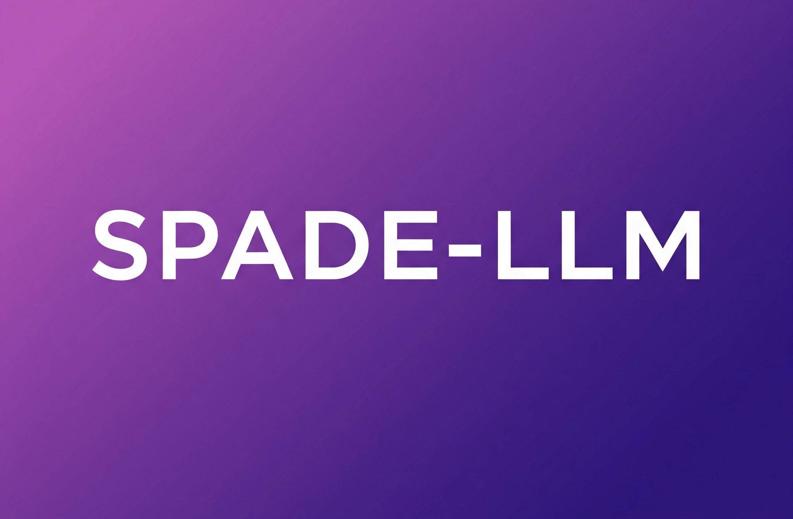
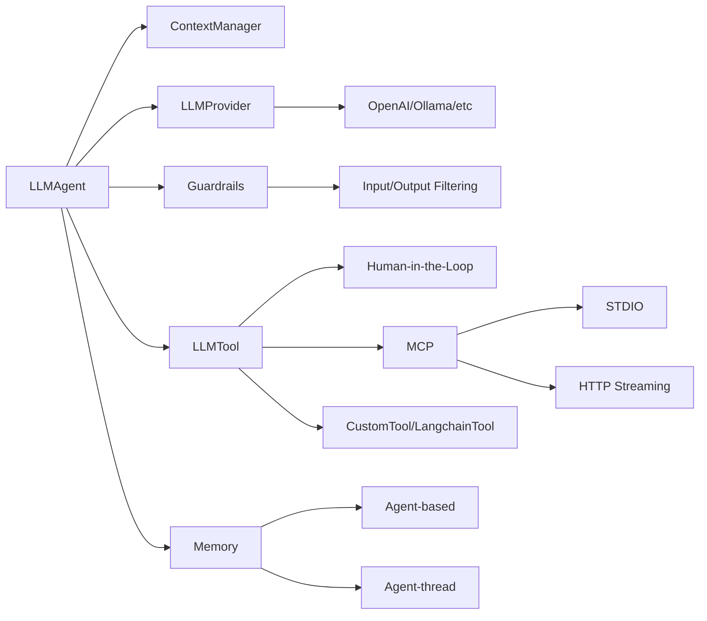

<div align="center">
  
</div>

<div align="center">


[](https://pypi.org/project/spade-llm/)
[](https://opensource.org/licenses/MIT)
[](https://coveralls.io/github/sosanzma/spade_llm?branch=main)

[](https://github.com/sosanzma/spade_llm/actions)
[](https://github.com/sosanzma/spade_llm/actions/workflows/docs.yml)

[**Documentation**](https://sosanzma.github.io/spade_llm/) | [**Quick Start**](https://sosanzma.github.io/spade_llm/getting-started/quickstart/) | [**Examples**](https://sosanzma.github.io/spade_llm/reference/examples/) | [**API Reference**](https://sosanzma.github.io/spade_llm/reference/)

</div>

# SPADE-LLM: Large Language Model Integration for Multi-Agent Systems

**SPADE-LLM** is a Python framework that extends [SPADE](https://spadeagents.eu) multi-agent platform with Large Language Model capabilities. Build AI agents powered by OpenAI GPT, Ollama, LM Studio, and other LLM providers for multi-agent systems, distributed AI applications, and intelligent chatbots.

**Keywords**: SPADE, LLM, large language models, multi-agent systems, AI agents, OpenAI, GPT, Ollama, chatbot framework, distributed AI, Python AI, agent communication, XMPP agents, AI collaboration

## Table of Contents

- [Key Features](#key-features)
- [Quick Start](#quick-start)
- [Installation](#installation)
- [Architecture](#architecture)
- [Documentation](#documentation)
- [Examples](#examples)
  - [Multi-Provider Support](#multi-provider-support)
  - [Tools and Function Calling](#tools-and-function-calling)
  - [Content Safety with Guardrails](#content-safety-with-guardrails)
  - [Message Routing](#message-routing)
  - [Interactive Chat](#interactive-chat)
  - [Memory Extensions](#memory-extensions)
  - [Context Management](#context-management)
  - [Human-in-the-Loop](#human-in-the-loop)
- [Requirements](#requirements)
- [Contributing](#contributing)
- [License](#license)

## Key Features

- **Multi-LLM Provider Support** - Integrate OpenAI GPT-4, Ollama local models, LM Studio, vLLM, Anthropic Claude, Google Gemini
- **Advanced Tool System** - Function calling, async execution, LangChain tool integration, custom tool development
- **Smart Context Management** - Multi-conversation support, automatic cleanup, sliding window, token-aware context
- **Persistent Memory** - Agent-based memory, conversation threading, long-term state persistence across sessions
- **Intelligent Message Routing** - Conditional routing based on LLM responses, dynamic agent selection
- **Content Safety Guardrails** - Input/output filtering, keyword blocking, content moderation, safety controls
- **MCP Integration** - Model Context Protocol server support for external tools and services
- **Human-in-the-Loop** - Web interface for human expert consultation, interactive decision making

## Quick Start

```python
import spade
from spade_llm import LLMAgent, LLMProvider

async def main():
    provider = LLMProvider.create_openai(
        api_key="your-api-key",
        model="gpt-4o-mini"
    )
    
    agent = LLMAgent(
        jid="assistant@example.com",
        password="password",
        provider=provider,
        system_prompt="You are a helpful assistant"
    )
    
    await agent.start()

if __name__ == "__main__":
    spade.run(main())
```

## Installation

```bash
pip install spade_llm
```

## Examples

### Multi-Provider Support

```python
# OpenAI
provider = LLMProvider.create_openai(api_key="key", model="gpt-4o-mini")

# Ollama (local)
provider = LLMProvider.create_ollama(model="llama3.1:8b")

# LM Studio (local)
provider = LLMProvider.create_lm_studio(model="local-model")
```

### Tools and Function Calling

```python
from spade_llm import LLMTool

async def get_weather(city: str) -> str:
    return f"Weather in {city}: 22°C, sunny"

weather_tool = LLMTool(
    name="get_weather",
    description="Get weather for a city",
    parameters={
        "type": "object",
        "properties": {"city": {"type": "string"}},
        "required": ["city"]
    },
    func=get_weather
)

agent = LLMAgent(
    jid="assistant@example.com",
    password="password",
    provider=provider,
    tools=[weather_tool]
)
```

### Content Safety with Guardrails

```python
from spade_llm.guardrails import KeywordGuardrail, GuardrailAction

# Block harmful content
safety_filter = KeywordGuardrail(
    name="safety_filter",
    blocked_keywords=["hack", "exploit", "malware"],
    action=GuardrailAction.BLOCK,
    blocked_message="I cannot help with potentially harmful activities."
)

agent = LLMAgent(
    jid="assistant@example.com",
    password="password",
    provider=provider,
    input_guardrails=[safety_filter]  # Filter incoming messages
)
```

### Message Routing

```python
def router(msg, response, context):
    if "technical" in response.lower():
        return "tech-support@example.com"
    return str(msg.sender)

agent = LLMAgent(
    jid="router@example.com",
    password="password",
    provider=provider,
    routing_function=router
)
```

### Interactive Chat

```python
from spade_llm import ChatAgent

# Create chat interface
chat_agent = ChatAgent(
    jid="human@example.com",
    password="password",
    target_agent_jid="assistant@example.com"
)

await chat_agent.start()
await chat_agent.run_interactive()  # Start interactive chat
```

### Memory Extensions

```python
# Agent-based memory: Single shared memory per agent
agent = LLMAgent(
    jid="assistant@example.com",
    password="password",
    provider=provider,
    agent_base_memory=(True, "./memory.db")  # Enabled with custom path
)

# Agent-thread memory: Separate memory per conversation
agent = LLMAgent(
    jid="assistant@example.com",
    password="password",
    provider=provider,
    agent_thread_memory=(True, "./thread_memory.db")  # Enabled with custom path
)

# Default memory paths (if path not specified)
agent = LLMAgent(
    jid="assistant@example.com",
    password="password",
    provider=provider,
    agent_base_memory=(True, None)  # Uses default path
)
```

### Context Management

```python
from spade_llm.context import SmartWindowSizeContext, FixedWindowSizeContext

# Smart context: Dynamic window sizing based on content
smart_context = SmartWindowSizeContext(
    max_tokens=4000,
    include_system_prompt=True,
    preserve_last_k_messages=5
)

# Fixed context: Traditional sliding window
fixed_context = FixedWindowSizeContext(
    max_messages=20,
    include_system_prompt=True
)

agent = LLMAgent(
    jid="assistant@example.com",
    password="password",
    provider=provider,
    context_manager=smart_context
)
```

### Human-in-the-Loop

```python
from spade_llm import HumanInTheLoopTool

# Create tool for human consultation
human_tool = HumanInTheLoopTool(
    human_expert_jid="expert@example.com",
    timeout=300.0  # 5 minutes
)

agent = LLMAgent(
    jid="assistant@example.com",
    password="password",
    provider=provider,
    tools=[human_tool]  # Pass tools in constructor
)

# Start web interface for human expert
# python -m spade_llm.human_interface.web_server
# Open http://localhost:8080 and connect as expert
```

## Architecture



## Documentation

- **[Installation](https://sosanzma.github.io/spade_llm/getting-started/installation/)** - Setup and requirements
- **[Quick Start](https://sosanzma.github.io/spade_llm/getting-started/quickstart/)** - Basic usage examples
- **[Providers](https://sosanzma.github.io/spade_llm/guides/providers/)** - LLM provider configuration
- **[Tools](https://sosanzma.github.io/spade_llm/guides/tools-system/)** - Function calling system
- **[Guardrails](https://sosanzma.github.io/spade_llm/guides/guardrails/)** - Content filtering and safety
- **[API Reference](https://sosanzma.github.io/spade_llm/reference/)** - Complete API documentation

## Examples Directory

The `/examples` directory contains complete working examples:

- `multi_provider_chat_example.py` - Chat with different LLM providers
- `ollama_with_tools_example.py` - Local models with tool calling
- `langchain_tools_example.py` - LangChain tool integration
- `guardrails_example.py` - Content filtering and safety controls
- `human_in_the_loop_example.py` - Human expert consultation via web interface
- `valencia_multiagent_trip_planner.py` - Multi-agent workflow

## Requirements

- Python 3.10+
- SPADE 3.3.0+

## Contributing

1. Fork the repository
2. Create a feature branch
3. Add tests for new functionality
4. Submit a pull request

See [Contributing Guide](https://sosanzma.github.io/spade_llm/contributing/) for details.

## License

MIT License
