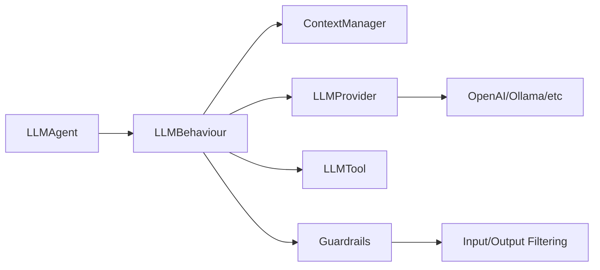

# SPADE_LLM

Extension for [SPADE](https://github.com/javipalanca/spade) that integrates Large Language Models into multi-agent systems.

## Features

- **Multi-Provider Support**: OpenAI, Ollama, LM Studio, vLLM
- **Tool System**: Function calling with async execution
- **Context Management**: Multi-conversation support with automatic cleanup
- **Message Routing**: Conditional routing based on LLM responses
- **Guardrails System**: Content filtering and safety controls for input/output
- **MCP Integration**: Model Context Protocol server support
- **Human-in-the-Loop**: Web interface for human expert consultation
- **Production Ready**: Comprehensive error handling and logging

## Quick Start

```python
import spade
from spade_llm import LLMAgent, LLMProvider

async def main():
    provider = LLMProvider.create_openai(
        api_key="your-api-key",
        model="gpt-4o-mini"
    )
    
    agent = LLMAgent(
        jid="assistant@example.com",
        password="password",
        provider=provider,
        system_prompt="You are a helpful assistant"
    )
    
    await agent.start()

if __name__ == "__main__":
    spade.run(main())
```

## Installation

```bash
pip install spade_llm
```

## Examples

### Multi-Provider Support

```python
# OpenAI
provider = LLMProvider.create_openai(api_key="key", model="gpt-4o-mini")

# Ollama (local)
provider = LLMProvider.create_ollama(model="llama3.1:8b")

# LM Studio (local)
provider = LLMProvider.create_lm_studio(model="local-model")
```

### Tools and Function Calling

```python
from spade_llm import LLMTool

async def get_weather(city: str) -> str:
    return f"Weather in {city}: 22°C, sunny"

weather_tool = LLMTool(
    name="get_weather",
    description="Get weather for a city",
    parameters={
        "type": "object",
        "properties": {"city": {"type": "string"}},
        "required": ["city"]
    },
    func=get_weather
)

agent = LLMAgent(
    jid="assistant@example.com",
    password="password",
    provider=provider,
    tools=[weather_tool]
)
```

### Content Safety with Guardrails

```python
from spade_llm.guardrails import KeywordGuardrail, GuardrailAction

# Block harmful content
safety_filter = KeywordGuardrail(
    name="safety_filter",
    blocked_keywords=["hack", "exploit", "malware"],
    action=GuardrailAction.BLOCK,
    blocked_message="I cannot help with potentially harmful activities."
)

agent = LLMAgent(
    jid="assistant@example.com",
    password="password",
    provider=provider,
    input_guardrails=[safety_filter]  # Filter incoming messages
)
```

### Message Routing

```python
def router(msg, response, context):
    if "technical" in response.lower():
        return "tech-support@example.com"
    return str(msg.sender)

agent = LLMAgent(
    jid="router@example.com",
    password="password",
    provider=provider,
    routing_function=router
)
```

### Interactive Chat

```python
from spade_llm import ChatAgent

# Create chat interface
chat_agent = ChatAgent(
    jid="human@example.com",
    password="password",
    target_agent_jid="assistant@example.com"
)

await chat_agent.start()
await chat_agent.run_interactive()  # Start interactive chat
```

### Human-in-the-Loop

```python
from spade_llm import HumanInTheLoopTool

# Create tool for human consultation
human_tool = HumanInTheLoopTool(
    human_expert_jid="expert@example.com",
    timeout=300.0  # 5 minutes
)

agent = LLMAgent(
    jid="assistant@example.com",
    password="password",
    provider=provider,
    tools=[human_tool]  # Pass tools in constructor
)

# Start web interface for human expert
# python -m spade_llm.human_interface.web_server
# Open http://localhost:8080 and connect as expert
```

## Architecture



## Documentation

- **[Installation](https://sosanzma.github.io/spade_llm/getting-started/installation/)** - Setup and requirements
- **[Quick Start](https://sosanzma.github.io/spade_llm/getting-started/quickstart/)** - Basic usage examples
- **[Providers](https://sosanzma.github.io/spade_llm/guides/providers/)** - LLM provider configuration
- **[Tools](https://sosanzma.github.io/spade_llm/guides/tools-system/)** - Function calling system
- **[Guardrails](https://sosanzma.github.io/spade_llm/guides/guardrails/)** - Content filtering and safety
- **[API Reference](https://sosanzma.github.io/spade_llm/reference/)** - Complete API documentation

## Examples

The `/examples` directory contains complete working examples:

- `multi_provider_chat_example.py` - Chat with different LLM providers
- `ollama_with_tools_example.py` - Local models with tool calling
- `langchain_tools_example.py` - LangChain tool integration
- `guardrails_example.py` - Content filtering and safety controls
- `human_in_the_loop_example.py` - Human expert consultation via web interface
- `valencia_multiagent_trip_planner.py` - Multi-agent workflow

## Requirements

- Python 3.10+
- SPADE 3.3.0+

## License

MIT License

## Contributing

1. Fork the repository
2. Create a feature branch
3. Add tests for new functionality
4. Submit a pull request

See [Contributing Guide](https://sosanzma.github.io/spade_llm/contributing/) for details.
