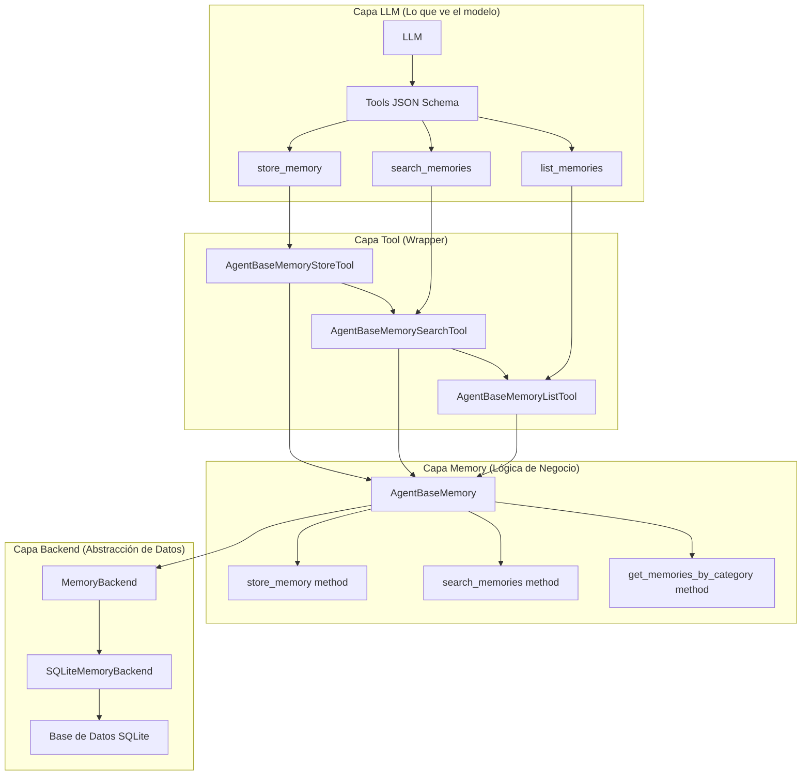
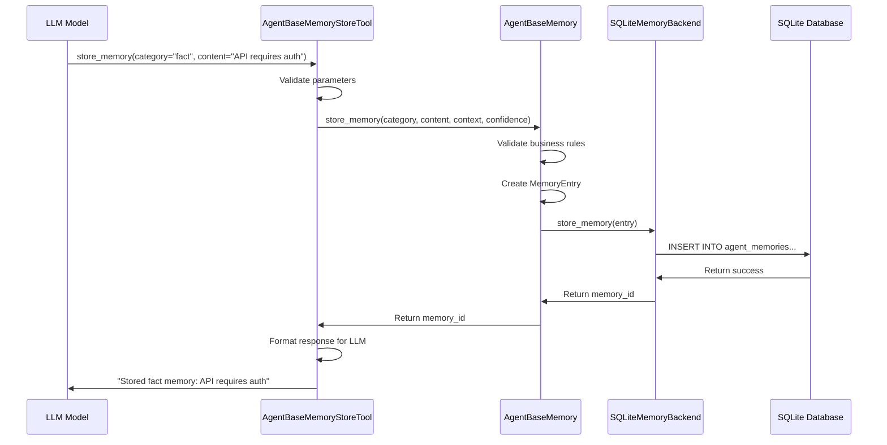

# Agent Memory Tool Interaction

Este documento explica exactamente qué información ve el LLM cuando interactúa con el sistema de memoria del agente. El LLM no ve la arquitectura interna del backend, sino que interactúa con herramientas (tools) que actúan como wrappers de la funcionalidad subyacente.

## Arquitectura de Capas

El sistema de memoria funciona con una separación clara de capas:



## Tools que ve el LLM

### 🔧 Tool 1: `store_memory`

**Nombre:** `store_memory`

**Descripción que ve el LLM:**
```
Store important information in my long-term memory for future use.
Use this tool to remember:
- Facts: Concrete information about APIs, data formats, configurations, etc.
- Patterns: Recurring behaviors or trends I've observed
- Preferences: User preferences or system settings I've learned
- Capabilities: My own abilities or limitations I've discovered

This memory persists across conversations and helps me improve over time.
```

**Parámetros JSON Schema:**
```json
{
  "type": "object",
  "properties": {
    "category": {
      "type": "string",
      "enum": ["fact", "pattern", "preference", "capability"],
      "description": "Type of memory: fact (concrete info), pattern (observed behavior), preference (learned preference), capability (my ability/limitation)"
    },
    "content": {
      "type": "string",
      "description": "The information to remember. Be specific and concise."
    },
    "context": {
      "type": "string",
      "description": "Optional context about when/why this is important"
    },
    "confidence": {
      "type": "number",
      "minimum": 0.0,
      "maximum": 1.0,
      "default": 1.0,
      "description": "Confidence level in this memory (0.0 to 1.0)"
    }
  },
  "required": ["category", "content"]
}
```

### 🔍 Tool 2: `search_memories`

**Nombre:** `search_memories`

**Descripción que ve el LLM:**
```
Search my long-term memory for information relevant to the current conversation.
Use this tool when you need to recall:
- Previous facts you've learned
- Patterns you've observed
- User preferences you've discovered
- Your own capabilities or limitations

The search looks through all your stored memories to find relevant information.
```

**Parámetros JSON Schema:**
```json
{
  "type": "object",
  "properties": {
    "query": {
      "type": "string",
      "description": "Search query to find relevant memories. Use keywords related to what you're looking for."
    },
    "limit": {
      "type": "integer",
      "minimum": 1,
      "maximum": 20,
      "default": 10,
      "description": "Maximum number of memories to retrieve"
    }
  },
  "required": ["query"]
}
```

### 📋 Tool 3: `list_memories`

**Nombre:** `list_memories`

**Descripción que ve el LLM:**
```
List my memories organized by category.
Use this tool to browse what you've learned in different areas:
- Facts: Concrete information you've stored
- Patterns: Behavioral patterns you've observed
- Preferences: User or system preferences you've learned
- Capabilities: Your own abilities or limitations you've discovered

This helps you understand what knowledge you have available.
```

**Parámetros JSON Schema:**
```json
{
  "type": "object",
  "properties": {
    "category": {
      "type": "string",
      "enum": ["fact", "pattern", "preference", "capability"],
      "description": "Category of memories to list"
    },
    "limit": {
      "type": "integer",
      "minimum": 1,
      "maximum": 50,
      "default": 20,
      "description": "Maximum number of memories to retrieve"
    }
  },
  "required": ["category"]
}
```

## Respuestas que recibe el LLM

### Para `store_memory`:
```
"Stored fact memory: API endpoint is https://api.example.com/v1"
```
o en caso de error:
```
"Failed to store memory: Invalid category 'invalid_category'"
```

### Para `search_memories`:
```
Found 3 memories for 'API':
- [fact] API endpoint is https://api.example.com/v1
  Context: API integration discussion
- [pattern] Users often ask about API authentication
  Context: User assistance patterns
- [preference] User prefers detailed API examples
```

### Para `list_memories`:
```
My fact memories (5 total):
- API endpoint is https://api.example.com/v1
  Context: API integration discussion
- Database connection requires SSL on port 5432
- User authentication uses JWT tokens
- PostgreSQL default port is 5432
- REST APIs typically use JSON format
```

## Ejemplo de Prompt Completo que ve el LLM

Cuando el LLM recibe un mensaje, ve algo así:

```json
{
  "messages": [
    {
      "role": "system",
      "content": "You are a helpful assistant with memory capabilities. You can store and retrieve information using the available tools."
    },
    {
      "role": "user", 
      "content": "What do you know about APIs?"
    }
  ],
  "tools": [
    {
      "type": "function",
      "function": {
        "name": "store_memory",
        "description": "Store important information in my long-term memory for future use.\nUse this tool to remember:\n- Facts: Concrete information about APIs, data formats, configurations, etc.\n- Patterns: Recurring behaviors or trends I've observed\n- Preferences: User preferences or system settings I've learned\n- Capabilities: My own abilities or limitations I've discovered\n\nThis memory persists across conversations and helps me improve over time.",
        "parameters": {
          "type": "object",
          "properties": {
            "category": {
              "type": "string",
              "enum": ["fact", "pattern", "preference", "capability"],
              "description": "Type of memory: fact (concrete info), pattern (observed behavior), preference (learned preference), capability (my ability/limitation)"
            },
            "content": {
              "type": "string",
              "description": "The information to remember. Be specific and concise."
            },
            "context": {
              "type": "string",
              "description": "Optional context about when/why this is important"
            },
            "confidence": {
              "type": "number",
              "minimum": 0.0,
              "maximum": 1.0,
              "default": 1.0,
              "description": "Confidence level in this memory (0.0 to 1.0)"
            }
          },
          "required": ["category", "content"]
        }
      }
    },
    {
      "type": "function",
      "function": {
        "name": "search_memories",
        "description": "Search my long-term memory for information relevant to the current conversation.\nUse this tool when you need to recall:\n- Previous facts you've learned\n- Patterns you've observed\n- User preferences you've discovered\n- Your own capabilities or limitations\n\nThe search looks through all your stored memories to find relevant information.",
        "parameters": {
          "type": "object",
          "properties": {
            "query": {
              "type": "string",
              "description": "Search query to find relevant memories. Use keywords related to what you're looking for."
            },
            "limit": {
              "type": "integer",
              "minimum": 1,
              "maximum": 20,
              "default": 10,
              "description": "Maximum number of memories to retrieve"
            }
          },
          "required": ["query"]
        }
      }
    },
    {
      "type": "function",
      "function": {
        "name": "list_memories",
        "description": "List my memories organized by category.\nUse this tool to browse what you've learned in different areas:\n- Facts: Concrete information you've stored\n- Patterns: Behavioral patterns you've observed\n- Preferences: User or system preferences you've learned\n- Capabilities: Your own abilities or limitations you've discovered\n\nThis helps you understand what knowledge you have available.",
        "parameters": {
          "type": "object",
          "properties": {
            "category": {
              "type": "string",
              "enum": ["fact", "pattern", "preference", "capability"],
              "description": "Category of memories to list"
            },
            "limit": {
              "type": "integer",
              "minimum": 1,
              "maximum": 50,
              "default": 20,
              "description": "Maximum number of memories to retrieve"
            }
          },
          "required": ["category"]
        }
      }
    }
  ]
}
```

## Flujo de Interacción Completo



## Categorías de Memoria

El LLM debe categorizar la información en uno de estos tipos:

### 1. **fact** (Hechos)
- Información concreta y verificable
- Ejemplos: "API endpoint is https://api.example.com/v1", "PostgreSQL default port is 5432"

### 2. **pattern** (Patrones)
- Comportamientos recurrentes o tendencias observadas
- Ejemplos: "Users often ask about API authentication", "Database queries perform better with indexes"

### 3. **preference** (Preferencias)
- Preferencias del usuario o configuraciones del sistema
- Ejemplos: "User prefers detailed explanations", "System should use UTC timezone"

### 4. **capability** (Capacidades)
- Habilidades o limitaciones del propio agente
- Ejemplos: "Can generate SQL queries for PostgreSQL", "Cannot access external APIs without authentication"

## Conclusión

El LLM ve las tools como funciones disponibles con descripciones claras y parámetros bien definidos. No tiene conocimiento de la arquitectura interna compleja (backends, bases de datos SQLite, etc.). Para el LLM, simplemente son 3 funciones que le permiten gestionar su memoria a largo plazo de forma consciente y estructurada.