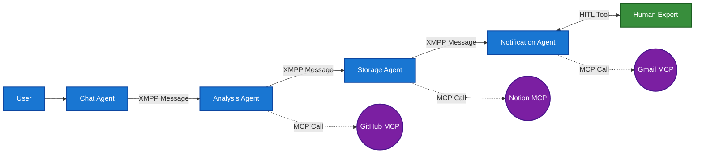

# Advanced Multi-Feature Agent Tutorial

In this tutorial, you'll learn how to create sophisticated multi-agent systems with advanced features like MCP integration, human-in-the-loop workflows, custom guardrails, and complex routing. This tutorial is based on the `github_issues_monitor_example.py` and demonstrates production-ready patterns.

## What You'll Build

We'll create a comprehensive GitHub monitoring system with four specialized agents:

1. **Chat Agent** - User interface with custom guardrails
2. **Analysis Agent** - GitHub data collection and analysis via MCP
3. **Storage Agent** - Notion integration for data persistence
4. **Notification Agent** - Human-in-the-loop email confirmations

## Prerequisites

- Complete all previous tutorials ([First Agent](first-agent.md), [Guardrails](guardrails-tutorial.md), [Tools](tools-tutorial.md))
- Advanced Python knowledge (classes, async programming, error handling)
- Understanding of multi-agent systems concepts
- Access to external services (GitHub, Notion, Gmail - for demonstration)

## Architecture Overview



### Communication Flow Explanation

**XMPP Messages (solid arrows)**: Direct agent-to-agent communication
- Each agent sends structured messages to the next agent in the pipeline
- Messages contain conversation context and processing results
- Uses SPADE's built-in XMPP messaging system

**MCP Calls (dotted arrows)**: External service integration
- Agents call MCP servers to interact with external services
- MCP servers provide tools for GitHub, Notion, Gmail operations
- Responses are integrated back into the agent's processing

**Human-in-the-Loop (HITL)**: Interactive human consultation
- Agent asks human expert a question (e.g., "Send this email?")
- Human expert responds with decision and additional data (e.g., "Yes, send to user@example.com")
- Agent continues processing based on human response
- Bidirectional communication through web interface

## Agent-to-Agent Communication

### Understanding Agent Connections

In SPADE-LLM, agents communicate through XMPP messages. Here's how to establish connections:

#### 1. Direct Reply Configuration
The simplest way to connect agents is using the `reply_to` parameter:

```python
# Agent A sends messages to Agent B
agent_a = LLMAgent(
    jid="agent_a@server.com",
    password="password_a",
    provider=provider,
    reply_to="agent_b@server.com"  # All responses go to Agent B
)

# Agent B receives from Agent A and sends to Agent C
agent_b = LLMAgent(
    jid="agent_b@server.com", 
    password="password_b",
    provider=provider,
    reply_to="agent_c@server.com"  # Forward to Agent C
)
```

#### 2. ChatAgent Target Configuration
For user interfaces, use `target_agent_jid`:

```python
# User interface that sends to LLM Agent
chat_agent = ChatAgent(
    jid="user@server.com",
    password="password",
    target_agent_jid="assistant@server.com"  # Where user messages go
)
```

#### 3. Message Flow Pipeline
Create a processing pipeline by chaining agents:

```python
async def create_agent_pipeline():
    # Entry point: User → Chat Agent
    chat_agent = ChatAgent(
        jid="user@server.com",
        password="pwd1",
        target_agent_jid="analyzer@server.com"
    )
    
    # Step 1: Chat Agent → Analyzer Agent
    analyzer_agent = LLMAgent(
        jid="analyzer@server.com",
        password="pwd2",
        provider=provider,
        reply_to="storage@server.com"  # Forward to storage
    )
    
    # Step 2: Analyzer → Storage Agent
    storage_agent = LLMAgent(
        jid="storage@server.com",
        password="pwd3",
        provider=provider,
        reply_to="notification@server.com"  # Forward to notification
    )
    
    # Step 3: Storage → Notification Agent (end of pipeline)
    notification_agent = LLMAgent(
        jid="notification@server.com",
        password="pwd4",
        provider=provider,
        # No reply_to = end of pipeline
    )
    
    return chat_agent, analyzer_agent, storage_agent, notification_agent
```

#### 4. Conditional Routing
Use routing functions for dynamic agent selection:

```python
def smart_router(msg, response, context):
    """Route messages based on content analysis."""
    if "urgent" in response.lower():
        return "urgent_handler@server.com"
    elif "storage" in response.lower():
        return "storage_agent@server.com"
    else:
        return "default_handler@server.com"

# Agent with conditional routing
router_agent = LLMAgent(
    jid="router@server.com",
    password="password",
    provider=provider,
    routing_function=smart_router  # Dynamic routing
)
```

#### 5. Message Context Preservation
Agents automatically maintain conversation context:

```python
# Context flows through the pipeline
# User: "Analyze repository issues"
# → Chat Agent → Analyzer Agent (receives full context)
# → Storage Agent (receives context + analysis)
# → Notification Agent (receives context + analysis + storage confirmation)
```

## Step 1: Custom Guardrails

First, let's create a custom guardrail that only allows GitHub-related requests:

```python
from spade_llm.guardrails.base import Guardrail, GuardrailResult, GuardrailAction
from typing import Dict, Any

class GitHubOnlyGuardrail(Guardrail):
    """Custom guardrail that only allows GitHub-related requests."""
    
    def __init__(self, name: str = "github_only_filter", enabled: bool = True):
        super().__init__(name, enabled, "I only help with GitHub-related requests. Please ask about issues, pull requests, or repository monitoring.")
        self.github_keywords = [
            "github", "issue", "issues", "pull request", "pr", "prs", 
            "repository", "repo", "commit", "branch", "merge", "review",
            "bug", "feature", "enhancement", "milestone", "project",
            "analyze", "monitor", "check", "status", "activity"
        ]
    
    async def check(self, content: str, context: Dict[str, Any]) -> GuardrailResult:
        """Check if content is GitHub-related."""
        content_lower = content.lower()
        
        # Check if any GitHub keyword is present
        if any(keyword in content_lower for keyword in self.github_keywords):
            return GuardrailResult(
                action=GuardrailAction.PASS,
                content=content,
                reason="GitHub-related request detected"
            )
        else:
            return GuardrailResult(
                action=GuardrailAction.BLOCK,
                content=self.blocked_message,
                reason="Non-GitHub request blocked"
            )

def create_github_guardrails():
    """Create input guardrails for GitHub-only requests."""
    return [GitHubOnlyGuardrail()]
```

## Step 2: MCP Server Configuration

Configure external MCP servers for GitHub, Notion, and Gmail integration:

```python
from spade_llm.mcp import StreamableHttpServerConfig

def create_mcp_servers():
    """Create MCP server configurations."""
    
    # GitHub MCP server
    github_mcp = StreamableHttpServerConfig(
        name="GitHubMCP",
        url="https://your-mcp-server.com/github/endpoint",  # Replace with your MCP server
        headers={
            "Content-Type": "application/json",
            "User-Agent": "SPADE_LLM/1.0"
        },
        timeout=30.0,
        sse_read_timeout=300.0,
        terminate_on_close=True,
        cache_tools=True
    )
    
    # Notion MCP server
    notion_mcp = StreamableHttpServerConfig(
        name="NotionMCP",
        url="https://your-mcp-server.com/notion/endpoint",  # Replace with your MCP server
        headers={
            "Content-Type": "application/json",
            "User-Agent": "SPADE_LLM/1.0"
        },
        timeout=30.0,
        sse_read_timeout=300.0,
        terminate_on_close=True,
        cache_tools=True
    )
    
    # Gmail MCP server
    gmail_mcp = StreamableHttpServerConfig(
        name="GmailMCP",
        url="https://your-mcp-server.com/gmail/endpoint",  # Replace with your MCP server
        headers={
            "Content-Type": "application/json",
            "User-Agent": "SPADE_LLM/1.0"
        },
        timeout=30.0,
        sse_read_timeout=300.0,
        terminate_on_close=True,
        cache_tools=True
    )
    
    return github_mcp, notion_mcp, gmail_mcp
```

## Step 3: Specialized Agent System Prompts

Create detailed system prompts for each agent:

```python
GITHUB_ANALYZER_PROMPT = """You are a GitHub analysis specialist. You receive GitHub monitoring requests and provide comprehensive repository analysis.

Your workflow:
1. Identify the repository to analyze (ask user if not specified)
2. Use GitHub MCP tools to gather data:
   - List recent issues (open and closed, last 30 days)
   - List recent pull requests (all states, last 30 days)
   - Get repository details if available
3. Analyze the collected data for patterns, priorities, and insights
4. Generate a structured summary with actionable information

IMPORTANT: 
- Always specify which repository you're analyzing
- Include actual numbers and real data from the GitHub API
- Focus on actionable insights and trends
- Identify urgent items that need attention

Response format:
=== GITHUB REPOSITORY ANALYSIS ===

🏪 Repository: [owner/repo-name]
📅 Analysis Date: [current date and time]
🔍 Analysis Period: Last 30 days

📊 SUMMARY METRICS
- Issues: [X] total ([X] open, [X] closed)
- Pull Requests: [X] total ([X] open, [X] merged, [X] draft, [X] closed)
- Recent Activity Level: [High/Medium/Low]
- Last Updated: [when]

🚨 URGENT ITEMS (High Priority)
[List critical issues/PRs that need immediate attention, include #numbers and titles]

📈 RECENT TRENDS (Last 30 days)
- New Issues Created: [X]
- Issues Closed: [X] 
- PRs Merged: [X]
- Most Active Contributors: [list top 3]
- Common Labels/Categories: [list most frequent]

🔍 KEY INSIGHTS
[Notable patterns, recurring issues, areas needing attention]

💡 RECOMMENDATIONS
[Actionable suggestions based on the analysis]

<GITHUB_SUMMARY>
{
  "repository": "[owner/repo]",
  "analysis_date": "[ISO date]",
  "period_days": 30,
  "summary": {
    "total_issues": X,
    "open_issues": X,
    "closed_issues": X,
    "total_prs": X,
    "open_prs": X,
    "merged_prs": X,
    "draft_prs": X
  },
  "urgent_items": [
    {"type": "issue/pr", "number": X, "title": "...", "priority": "high", "url": "..."}
  ],
  "trends": {
    "new_issues": X,
    "closed_issues": X,
    "merged_prs": X,
    "top_contributors": ["...", "..."],
    "common_labels": ["...", "..."]
  },
  "insights": ["...", "..."],
  "recommendations": ["...", "..."]
}
</GITHUB_SUMMARY>

This analysis will now be stored in Notion and potentially sent via email."""

NOTION_MANAGER_PROMPT = """You are a Notion storage specialist. You receive GitHub analysis summaries and store them systematically.

Your workflow:
1. Receive complete GitHub analysis from GitHubAnalyzer agent
2. Use Notion MCP tools to:
   - Search for "GitHub monitoring" page
   - Add a new entry with all analysis data
   - Structure the data for easy reading
3. After successful storage, prepare the summary for email notification

IMPORTANT:
- Create consistent Notion entries for easy tracking over time
- Include the full analysis text for complete context
- Verify the data was stored before forwarding

Response format:
=== NOTION STORAGE COMPLETED ===

📚 **Notion Database Updated**
✅ Entry created: "[Repository] Analysis - [Date]"
🗂️  Database: GitHub Repository Monitoring
📊 Data stored:
   - Repository: [owner/repo]
   - Analysis Date: [date]
   - Issues: [X] total ([X] open)
   - PRs: [X] total ([X] open)

🔗 Notion URL: [if available]

📧 **Forwarding to Email Manager**
The complete analysis is now ready for potential email notification.

[Include the FULL original analysis text here for the Email Manager]"""

EMAIL_MANAGER_PROMPT = """You are an email notification specialist with human-in-the-loop confirmation. You receive GitHub analysis summaries and handle email notifications with human oversight.

Your workflow:
1. Receive complete GitHub analysis from Notion Manager
2. Extract key information and prepare a concise summary for human review
3. Use ask_human_expert tool to get human confirmation and email details
4. If approved, format and send professional email via Gmail MCP
5. ALWAYS end with termination marker after completing the process

HUMAN INTERACTION PROCESS:
1. Present a concise executive summary to the human
2. Ask: "Would you like to send this GitHub analysis via email?"
3. If YES: Ask "Please provide the recipient's email address(es)"
4. If NO: Acknowledge and end with termination marker
5. If email provided: Send formatted email, confirm delivery, and end with termination marker

EMAIL FORMAT (when sending):
Subject: "GitHub Repository Analysis - [Repository Name] - [Date]"

Email Content:
---
# GitHub Repository Analysis Report

**Repository:** [owner/repo-name]  
**Analysis Date:** [date]  
**Period Analyzed:** Last 30 days

## Executive Summary
- **Issues:** [X] total ([X] open, [X] closed)
- **Pull Requests:** [X] total ([X] open, [X] merged)
- **Activity Level:** [High/Medium/Low]
- **Urgent Items:** [X] items need attention

## Key Insights
[3-4 most important insights from analysis]

## Urgent Items Requiring Attention
[List critical issues/PRs with numbers and titles]

## Recommendations
[Top 3 actionable recommendations]

## Full Analysis
[Include complete detailed analysis from GitHubAnalyzer]

---
*This report was generated automatically and stored in Notion for tracking.*

TERMINATION:
- After sending email successfully: "Email sent successfully to [recipient]. <EMAIL_PROCESS_COMPLETE>"
- After human declines email: "GitHub analysis completed and stored in Notion. No email sent. <EMAIL_PROCESS_COMPLETE>"

IMPORTANT:
- Always summarize key points for human decision-making
- Wait for explicit human approval before sending emails
- Include repository name and key metrics in human interaction
- Use professional email formatting
- Confirm successful email delivery
- ALWAYS end with <EMAIL_PROCESS_COMPLETE> termination marker"""
```

## Step 4: Human-in-the-Loop Tool

Create a tool for human expert consultation:

```python
from spade_llm.tools import HumanInTheLoopTool

def create_human_tool(human_expert_jid: str):
    """Create human-in-the-loop tool for email confirmations."""
    return HumanInTheLoopTool(
        human_expert_jid=human_expert_jid,
        timeout=300.0,  # 5 minutes timeout
        name="ask_human_expert",
        description="Ask human expert for email sending confirmation and recipient details"
    )
```

## Step 5: Complete Multi-Agent System

Here's the complete advanced agent system:

```python
import asyncio
import getpass
import os
import spade
import logging
from datetime import datetime
from typing import Dict, Any

from spade_llm.agent import LLMAgent, ChatAgent
from spade_llm.providers import LLMProvider
from spade_llm.mcp import StreamableHttpServerConfig
from spade_llm.guardrails.base import Guardrail, GuardrailResult, GuardrailAction
from spade_llm.tools import HumanInTheLoopTool
from spade_llm.utils import load_env_vars

# Configure logging
logging.basicConfig(
    level=logging.INFO,
    format='%(asctime)s - %(name)s - %(levelname)s - %(message)s'
)
logger = logging.getLogger(__name__)

class GitHubOnlyGuardrail(Guardrail):
    """Custom guardrail that only allows GitHub-related requests."""
    
    def __init__(self, name: str = "github_only_filter", enabled: bool = True):
        super().__init__(name, enabled, "I only help with GitHub-related requests. Please ask about issues, pull requests, or repository monitoring.")
        self.github_keywords = [
            "github", "issue", "issues", "pull request", "pr", "prs", 
            "repository", "repo", "commit", "branch", "merge", "review",
            "bug", "feature", "enhancement", "milestone", "project",
            "analyze", "monitor", "check", "status", "activity"
        ]
    
    async def check(self, content: str, context: Dict[str, Any]) -> GuardrailResult:
        """Check if content is GitHub-related."""
        content_lower = content.lower()
        
        if any(keyword in content_lower for keyword in self.github_keywords):
            return GuardrailResult(
                action=GuardrailAction.PASS,
                content=content,
                reason="GitHub-related request detected"
            )
        else:
            return GuardrailResult(
                action=GuardrailAction.BLOCK,
                content=self.blocked_message,
                reason="Non-GitHub request blocked"
            )

def create_github_guardrails():
    """Create input guardrails for GitHub-only requests."""
    return [GitHubOnlyGuardrail()]

def create_mcp_servers():
    """Create MCP server configurations."""
    
    # GitHub MCP server
    github_mcp = StreamableHttpServerConfig(
        name="GitHubMCP",
        url="https://your-mcp-server.com/github/endpoint",  # Replace with actual MCP server
        headers={
            "Content-Type": "application/json",
            "User-Agent": "SPADE_LLM/1.0"
        },
        timeout=30.0,
        sse_read_timeout=300.0,
        terminate_on_close=True,
        cache_tools=True
    )
    
    # Notion MCP server
    notion_mcp = StreamableHttpServerConfig(
        name="NotionMCP",
        url="https://your-mcp-server.com/notion/endpoint",  # Replace with actual MCP server
        headers={
            "Content-Type": "application/json",
            "User-Agent": "SPADE_LLM/1.0"
        },
        timeout=30.0,
        sse_read_timeout=300.0,
        terminate_on_close=True,
        cache_tools=True
    )
    
    # Gmail MCP server
    gmail_mcp = StreamableHttpServerConfig(
        name="GmailMCP",
        url="https://your-mcp-server.com/gmail/endpoint",  # Replace with actual MCP server
        headers={
            "Content-Type": "application/json",
            "User-Agent": "SPADE_LLM/1.0"
        },
        timeout=30.0,
        sse_read_timeout=300.0,
        terminate_on_close=True,
        cache_tools=True
    )
    
    return github_mcp, notion_mcp, gmail_mcp

async def main():
    print("🚀 Advanced Multi-Agent GitHub Monitor System")
    print("=" * 60)
    
    # Load environment variables
    load_env_vars()
    
    # Get API keys
    openai_key = os.environ.get("OPENAI_API_KEY")
    if not openai_key:
        openai_key = getpass.getpass("Enter your OpenAI API key: ")
    
    # XMPP server configuration
    xmpp_server = input("Enter XMPP server domain (default: localhost): ") or "localhost"
    
    # Agent credentials
    agents_config = {
        "chat": (f"github_chat@{xmpp_server}", "GitHub Chat Interface"),
        "analyzer": (f"github_analyzer@{xmpp_server}", "GitHub Analyzer Agent"),
        "notion": (f"notion_manager@{xmpp_server}", "Notion Storage Agent"),
        "email": (f"email_manager@{xmpp_server}", "Email Manager Agent"),
        "human": (f"human_expert@{xmpp_server}", "Human Expert")
    }
    
    # Get passwords
    passwords = {}
    for role, (jid, label) in agents_config.items():
        passwords[role] = getpass.getpass(f"{label} password: ")
    
    # Create LLM provider
    provider = LLMProvider.create_openai(
        api_key=openai_key,
        model="gpt-4o-mini",
        temperature=0.7
    )
    
    # Create MCP servers
    print("\\n🔧 Configuring MCP servers...")
    github_mcp, notion_mcp, gmail_mcp = create_mcp_servers()
    
    # Create human-in-the-loop tool
    human_tool = HumanInTheLoopTool(
        human_expert_jid=agents_config["human"][0],
        timeout=300.0,  # 5 minutes
        name="ask_human_expert",
        description="Ask human expert for email sending confirmation and recipient details"
    )
    
    # Create guardrails
    input_guardrails = create_github_guardrails()
    
    # Create agents with structured message flow
    print("\\n🤖 Creating specialized agents...")
    
    # AGENT CONNECTION SETUP:
    # User → Chat Agent → Analyzer Agent → Notion Agent → Email Agent → Human Expert
    
    # 1. Chat Agent with Guardrails (Entry Point)
    # Receives user input and forwards to analyzer
    def display_response(message: str, sender: str):
        print(f"\\n🤖 GitHub Monitor: {message}")
        print("-" * 50)
    
    user_chat = ChatAgent(
        jid=agents_config["chat"][0],
        password=passwords["chat"],
        target_agent_jid=agents_config["analyzer"][0],  # → Sends to Analyzer Agent
        display_callback=display_response,
        verify_security=False
    )

    # 2. GitHub Analyzer Agent (Data Collection & Analysis)
    # Receives from Chat Agent, uses GitHub MCP, forwards to Notion Agent
    analyzer_agent = LLMAgent(
        jid=agents_config["analyzer"][0],
        password=passwords["analyzer"],
        provider=provider,
        system_prompt=GITHUB_ANALYZER_PROMPT,
        input_guardrails=input_guardrails,
        mcp_servers=[github_mcp],  # Uses GitHub MCP for data collection
        reply_to=agents_config["notion"][0],  # → Forwards to Notion Agent
        verify_security=False
    )
    
    # 3. Notion Manager Agent (Storage & Forwarding)
    # Receives from Analyzer Agent, uses Notion MCP, forwards to Email Agent
    notion_agent = LLMAgent(
        jid=agents_config["notion"][0],
        password=passwords["notion"],
        provider=provider,
        system_prompt=NOTION_MANAGER_PROMPT,
        mcp_servers=[notion_mcp],  # Uses Notion MCP for data storage
        reply_to=agents_config["email"][0],  # → Forwards to Email Agent
        verify_security=False
    )
    
    # 4. Email Manager Agent (HITL & Email Sending)
    # Receives from Notion Agent, uses Human-in-the-Loop tool and Gmail MCP
    # NO reply_to = End of pipeline
    email_agent = LLMAgent(
        jid=agents_config["email"][0],
        password=passwords["email"],
        provider=provider,
        system_prompt=EMAIL_MANAGER_PROMPT,
        tools=[human_tool],  # Human-in-the-Loop capability
        mcp_servers=[gmail_mcp],  # Uses Gmail MCP for email sending
        termination_markers=["<EMAIL_PROCESS_COMPLETE>"],  # End conversation after email process
        verify_security=False
        # No reply_to = This is the end of the pipeline
    )
    
    # Start all agents
    print("\\n🚀 Starting multi-agent system...")
    agents = {
        "chat": user_chat,
        "analyzer": analyzer_agent, 
        "notion": notion_agent,
        "email": email_agent,
    }
    
    for name, agent in agents.items():
        await agent.start()
        print(f"✅ {name.capitalize()} agent started")
    
    # Wait for connections
    await asyncio.sleep(3.0)
    
    print("\\n" + "="*70)
    print("🐙 ADVANCED GITHUB MONITOR SYSTEM READY")
    print("="*70)
    print("\\n🎯 System capabilities:")
    print("1. 📊 Analyzes GitHub issues and pull requests via MCP")
    print("2. 📚 Stores analysis summaries in Notion database")
    print("3. 🤔 Consults human expert for email decisions")
    print("4. 📧 Sends professional email reports via Gmail MCP")
    print("\\n🛡️ Security: Custom guardrails ensure GitHub-only requests")
    print("🔧 Architecture: 4-agent pipeline with specialized roles")
    print("\\n💡 Example requests:")
    print("• 'Analyze recent issues in the repository'")
    print("• 'Check pull request activity this week'")
    print("• 'Monitor GitHub activity and send summary'")
    print("\\n⚠️  Note: MCP servers configured for external integrations")
    print("Ensure human expert is available for email confirmations.")
    print("\\nType 'exit' to quit\\n")
    print("-" * 70)
    
    # Instructions for human expert
    print(f"\\n👤 Human Expert Instructions:")
    print(f"🌐 Open web interface: http://localhost:8080")
    print(f"🔑 Connect as: {agents_config['human'][0]}")
    print("📧 You'll be asked about email sending decisions")
    
    try:
        # Run interactive chat
        await user_chat.run_interactive(
            input_prompt="🐙 GitHub> ",
            exit_command="exit",
            response_timeout=120.0  # Longer timeout for multi-agent processing
        )
    except KeyboardInterrupt:
        print("\\n👋 Shutting down...")
    finally:
        # Stop all agents
        print("\\n🔄 Stopping agents...")
        await user_chat.stop()
        for name, agent in agents.items():
            await agent.stop()
            print(f"✅ {name.capitalize()} agent stopped")
    
    print("\\n✅ Advanced GitHub Monitor system shutdown complete!")

if __name__ == "__main__":
    print("🚀 Starting Advanced Multi-Agent System...")
    print("\\n📋 Prerequisites:")
    print("• OpenAI API key")
    print("• XMPP server running")
    print("• MCP servers configured for GitHub/Notion/Gmail")
    print("• Human expert web interface: python -m spade_llm.human_interface.web_server")
    print()
    
    try:
        spade.run(main())
    except KeyboardInterrupt:
        print("\\n👋 System terminated by user")
    except Exception as e:
        print(f"\\n❌ System failed: {e}")
        print("💡 Check your configuration and try again")
```

## Key Advanced Features

### 1. Custom Guardrails
- **Purpose-built filtering**: Only GitHub-related requests allowed
- **Contextual validation**: Keyword-based content analysis
- **Flexible architecture**: Easy to extend with new rules

### 2. MCP Integration
- **External service access**: GitHub, Notion, Gmail via MCP
- **Streaming support**: Real-time data processing
- **Caching**: Improved performance with tool caching

### 3. Human-in-the-Loop
- **Human oversight**: Expert consultation for critical decisions
- **Timeout handling**: Graceful degradation if human unavailable
- **Web interface**: User-friendly expert dashboard

### 4. Multi-Agent Coordination
- **Specialized roles**: Each agent has specific responsibilities
- **Message routing**: Structured flow between agents
- **Termination markers**: Clean conversation endings

## Troubleshooting

### Common Issues

1. **Agent Communication Failures**
   - Check XMPP server connectivity
   - Verify agent JIDs and passwords
   - Review message routing configuration

2. **MCP Server Issues**
   - Verify MCP server URLs and authentication
   - Check network connectivity
   - Review timeout settings

3. **Human-in-the-Loop Problems**
   - Ensure web interface is running
   - Check human expert JID configuration
   - Verify timeout settings

4. **Performance Issues**
   - Monitor agent resource usage
   - Implement caching where appropriate
   - Use async operations for I/O

## Next Steps

Congratulations! You've built a sophisticated multi-agent system. To continue learning:

1. **Explore production deployment** - containerization, orchestration
2. **Study advanced routing patterns** - conditional logic, failover
3. **Implement monitoring** - metrics, alerting, health checks
4. **Add more integrations** - databases, APIs, external services

## Best Practices Summary

1. **Architecture**: Design for modularity and extensibility
2. **Security**: Implement comprehensive safety measures
3. **Monitoring**: Add logging and observability
4. **Testing**: Write comprehensive tests
5. **Documentation**: Maintain clear documentation
6. **Configuration**: Use environment-based configuration
7. **Error Handling**: Implement graceful failure handling

This tutorial demonstrates how SPADE-LLM can be used to build production-ready, multi-agent systems with advanced features and real-world integrations.