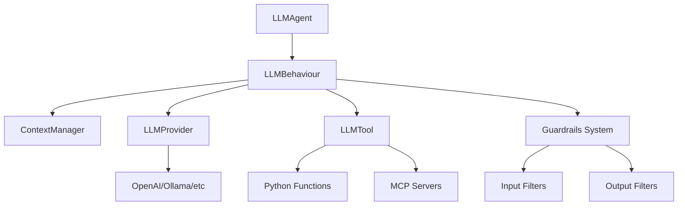
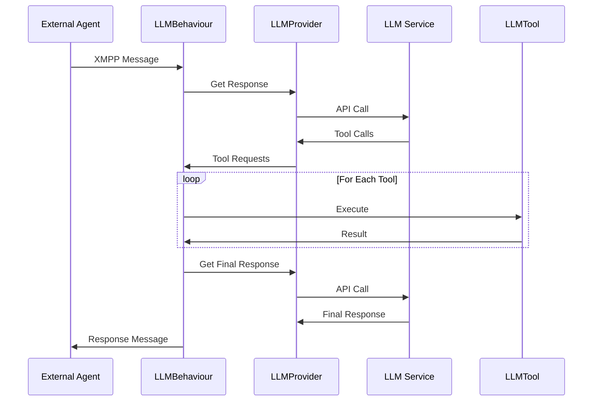

# Architecture

SPADE_LLM **extends SPADE's multi-agent framework** with LLM capabilities while maintaining _full compatibility_.

## Component Overview

## **🏗️ Core Components**

### **🤖 LLMAgent**
The **main agent class** that extends SPADE's `Agent` with LLM capabilities:

- **Manages LLM provider connection** and configuration
- **Registers tools** and handles their lifecycle
- **Controls conversation limits** and termination conditions
- Provides the _bridge_ between SPADE's XMPP messaging and LLM processing

### **⚡ LLMBehaviour**  
The **core processing engine** that orchestrates the entire LLM workflow:

1. **Receives XMPP messages** from other agents
2. **Updates conversation context** with new information
3. **Calls LLM provider** for responses
4. **Executes tools** when requested by the LLM
5. **Routes responses** to appropriate recipients

This is where the main processing occurs - transforming simple messages into interactions.

### **🧠 ContextManager**
**Manages conversation state** across multiple concurrent discussions:

- **Tracks multiple conversations** simultaneously by thread ID
- **Formats messages** appropriately for different LLM providers
- **Handles context windowing** to manage token limits efficiently
- Ensures each conversation maintains its _own context_ and history

### **🔌 LLMProvider**
**Unified interface** for different LLM services, providing consistency:

- **Abstracts provider-specific APIs** (OpenAI, Ollama, Anthropic, etc.)
- **Handles tool calling formats** across different providers
- **Provides consistent error handling** and retry mechanisms
- Makes it _easy to switch_ between different LLM services

### **🛠️ LLMTool**
**Framework for executable functions** that extend LLM capabilities:

- **Async execution support** for non-blocking operations
- **JSON Schema parameter validation** for type safety
- **Integration with LangChain and MCP** for ecosystem compatibility
- Enables LLMs to perform _real actions_ beyond conversation

## **📨 Message Flow**

## **🔄 Conversation Lifecycle**

The conversation lifecycle follows a **well-defined process**:

1. **Initialization**: New conversation created from message thread
2. **Processing**: Messages processed through LLM with tool execution
3. **Termination**: Ends via markers, limits, or manual control
4. **Cleanup**: Resources freed and callbacks executed

Each stage ensures conversations can handle complex, multi-turn interactions while maintaining system stability.

## **🔧 Integration Points**

The architecture provides multiple **integration points** for customization:

- **Custom Providers**: Add new LLM services
- **Tool Extensions**: Create domain-specific tools
- **Routing Logic**: Implement custom message routing
- **Context Management**: Customize conversation handling
- **MCP Integration**: Connect to external servers

This **flexible design** ensures SPADE_LLM can adapt to various use cases while maintaining its core multi-agent capabilities.

## Next Steps

- **[Providers](providers.md)** - Configure LLM providers
- **[Tools System](tools-system.md)** - Add tool capabilities
- **[Routing](routing.md)** - Implement message routing
- **[MCP](mcp.md)** - Connect to external services
