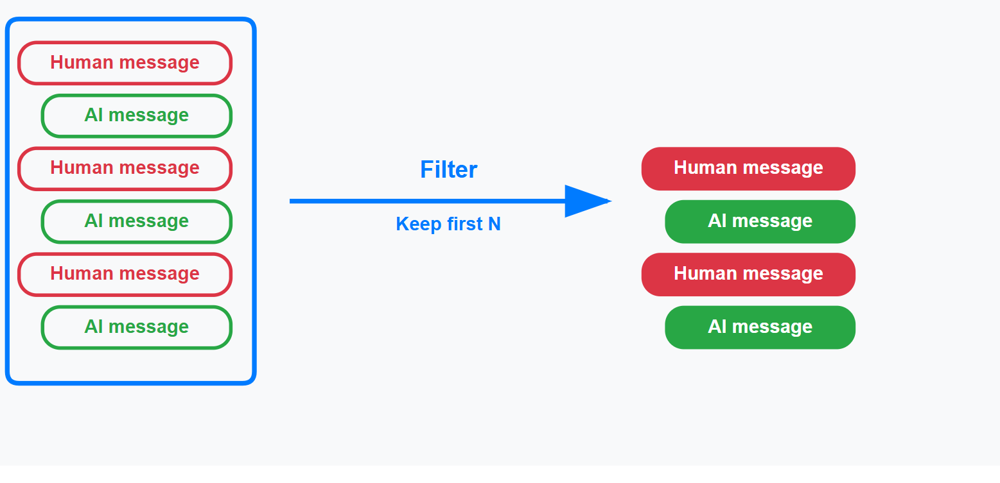
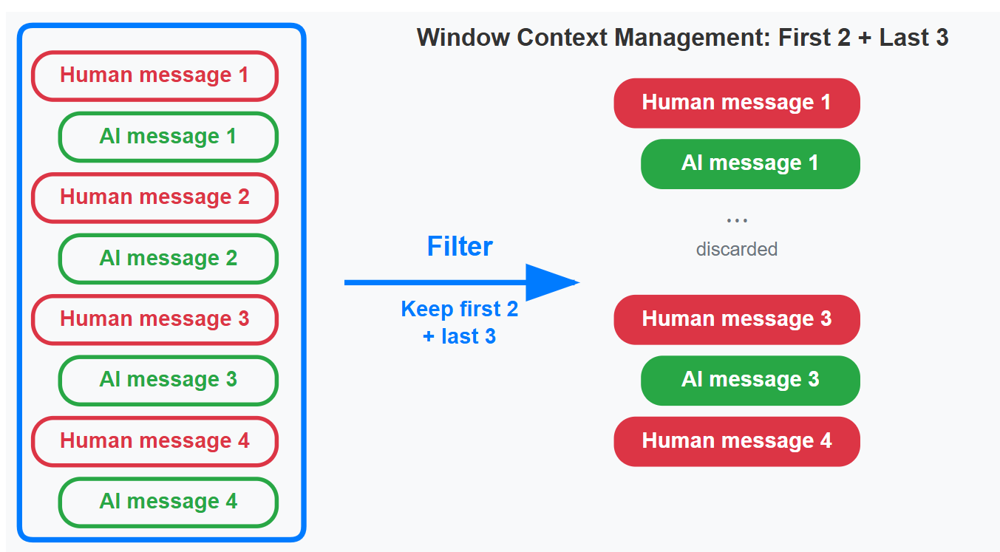
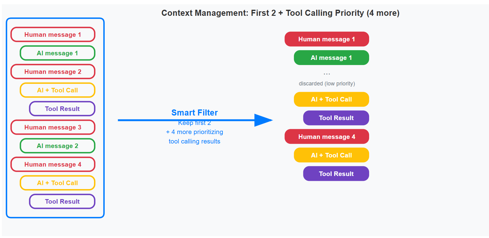

# Context Management

SPADE_LLM provides **sophisticated context management** to control conversation memory and optimize LLM performance across multi-turn interactions.

## Overview

The **context management system** handles how conversation history is maintained and filtered:

- **Memory Control**: Prevents token overflow while preserving important information
- **Multi-Strategy Support**: Choose from basic, windowed, or intelligent strategies
- **Tool-Aware**: Maintains critical tool execution context
- **Conversation Isolation**: Each conversation maintains separate context

## Context Strategies

### NoContextManagement (Default)

**Behavior**: Preserves all messages without any filtering or limitations.

```python
from spade_llm.context import NoContextManagement

# Keep all conversation history
context = NoContextManagement()

agent = LLMAgent(
    jid="assistant@example.com",
    password="password",
    provider=provider,
    context_management=context
)
```

**Characteristics**:
- ✅ Preserves complete conversation history
- ✅ No context loss
- ❌ Unlimited memory growth
- ❌ Potential LLM context overflow

**Use Cases**:
- Short conversations (< 10 exchanges)
- Debugging sessions requiring complete history
- Post-conversation analysis

### WindowSizeContext (Basic)

**Behavior**: Implements a sliding window maintaining only the last N messages.

```python
from spade_llm.context import WindowSizeContext

# Keep last 20 messages
context = WindowSizeContext(max_messages=20)

agent = LLMAgent(
    jid="assistant@example.com",
    password="password",
    provider=provider,
    context_management=context
)
```

**Visual Example**:



*Basic sliding window keeps only the most recent N messages, dropping older ones as new messages arrive.*

**Characteristics**:
- ✅ Predictable memory control
- ✅ Prevents context overflow
- ❌ Loses important initial context
- ❌ No message type differentiation

**Use Cases**:
- Long conversations with memory constraints
- Resource-limited environments
- Continuous monitoring sessions

### SmartWindowSizeContext (Advanced) 🆕

**Behavior**: Intelligent management combining sliding window with selective retention of critical messages.

#### Basic Configuration

```python
from spade_llm.context import SmartWindowSizeContext

# Standard behavior (equivalent to WindowSizeContext)
basic_context = SmartWindowSizeContext(max_messages=20)

# With initial message preservation
initial_preserve = SmartWindowSizeContext(
    max_messages=20,
    preserve_initial=3
)

# With tool prioritization
tool_priority = SmartWindowSizeContext(
    max_messages=20,
    prioritize_tools=True
)

# Full configuration
smart_context = SmartWindowSizeContext(
    max_messages=20,
    preserve_initial=3,
    prioritize_tools=True
)
```

#### Configuration Parameters

| Parameter | Type | Default | Description |
|-----------|------|---------|-------------|
| `max_messages` | `int` | 20 | Maximum messages in context |
| `preserve_initial` | `int` | 0 | Number of initial messages to always preserve |
| `prioritize_tools` | `bool` | False | Whether to prioritize tool results |

#### Intelligent Retention Algorithm

The SmartWindowSizeContext uses a sophisticated algorithm:

1. **If** `total_messages ≤ max_messages` → Return all messages
2. **If** `preserve_initial = 0` and `prioritize_tools = False` → Basic sliding window
3. **If** `preserve_initial > 0` → Preserve initial messages + fill with recent ones
4. **If** `prioritize_tools = True` → Prioritize tool results + fill remaining space
5. **If** both enabled → Combine preservation + prioritization strategies

#### Advanced Features

##### Initial Message Preservation

```python
# Example: 30 total messages, window=10, preserve_initial=3
# Result: [msg1, msg2, msg3] + [msg24, msg25, ..., msg30]

context = SmartWindowSizeContext(
    max_messages=10, 
    preserve_initial=3
)
```

**Visual Example**:



*Smart window preserves the first N messages (objectives, instructions) while filling remaining space with recent messages.*

**Benefits**: Preserves conversation objectives and fundamental context.

##### Tool Result Prioritization

```python
# Prioritizes all messages with role="tool"
context = SmartWindowSizeContext(
    max_messages=15, 
    prioritize_tools=True
)
```

**Algorithm**:
1. Extract all tool result messages
2. If tool messages ≥ max_messages → Keep recent tool messages
3. Otherwise → tool messages + recent messages to fill window
4. Reorder chronologically

##### Tool Call/Result Pair Preservation

The system automatically detects and preserves tool call/result pairs:

```python
# Automatically preserves:
# Assistant: "I'll check the weather" [tool_calls: get_weather]
# Tool: "22°C, sunny" [tool_call_id: matching_id]

context = SmartWindowSizeContext(
    max_messages=20,
    prioritize_tools=True
)
```

**Visual Example**:



*Smart window with initial preservation + tool prioritization maintains both conversation objectives and critical tool execution context.*

**Benefits**: Maintains execution context for complex tool workflows.

## Integration with LLMAgent

### Constructor Configuration

```python
from spade_llm.agent import LLMAgent
from spade_llm.context import SmartWindowSizeContext

# Create context strategy
smart_context = SmartWindowSizeContext(
    max_messages=20,
    preserve_initial=3,
    prioritize_tools=True
)

# Integrate with agent
agent = LLMAgent(
    jid="agent@example.com",
    password="password",
    provider=provider,
    context_management=smart_context,
    system_prompt="You are an assistant with intelligent context management..."
)
```


## Context Statistics

### Getting Statistics

```python
context = SmartWindowSizeContext(
    max_messages=20,
    preserve_initial=3,
    prioritize_tools=True
)

# Get stats for current conversation
stats = context.get_stats(total_messages=50)
```

### Statistics Format

```python
{
    "strategy": "smart_window_size",
    "max_messages": 20,
    "preserve_initial": 3,
    "prioritize_tools": True,
    "total_messages": 50,
    "messages_in_context": 20,
    "messages_dropped": 30
}
```

## Strategy Comparison

| Feature | NoContext | WindowSize | SmartWindowSize |
|---------|-----------|------------|-----------------|
| **Memory Control** | ❌ | ✅ | ✅ |
| **Preserves Initial Context** | ✅ | ❌ | ✅ (optional) |
| **Tool Prioritization** | ✅ | ❌ | ✅ (optional) |
| **Configuration Complexity** | None | Low | Medium |
| **Performance** | O(1) | O(1) | O(n log n) |
| **Memory Usage** | Unlimited | Limited | Limited |


## Complete Example

```python
import asyncio
from spade_llm.agent import LLMAgent
from spade_llm.context import SmartWindowSizeContext
from spade_llm.providers import LLMProvider

async def main():
    # Configure intelligent context management
    smart_context = SmartWindowSizeContext(
        max_messages=20,
        preserve_initial=3,
        prioritize_tools=True
    )
    
    # Create LLM provider
    provider = LLMProvider.create_openai(
        api_key="your-api-key",
        model="gpt-4"
    )
    
    # Create agent with smart context
    agent = LLMAgent(
        jid="smart_agent@example.com",
        password="password",
        provider=provider,
        context_management=smart_context,
        system_prompt="You are an intelligent assistant with context management."
    )
    
    await agent.start()
    
    # Monitor context during conversation
    while True:
        # ... agent processes messages ...
        
        # Check context stats periodically
        stats = agent.get_context_stats()
        if stats['messages_in_context'] > 15:
            print("Context approaching limit")
        
        await asyncio.sleep(1)

if __name__ == "__main__":
    asyncio.run(main())
```


## Next Steps

- **[Conversations](conversations.md)** - Learn about conversation lifecycle
- **[Memory System](memory.md)** - Explore agent memory capabilities
- **[Tools System](tools-system.md)** - Add tool capabilities
- **[API Reference](../reference/api/context.md)** - Detailed API documentation