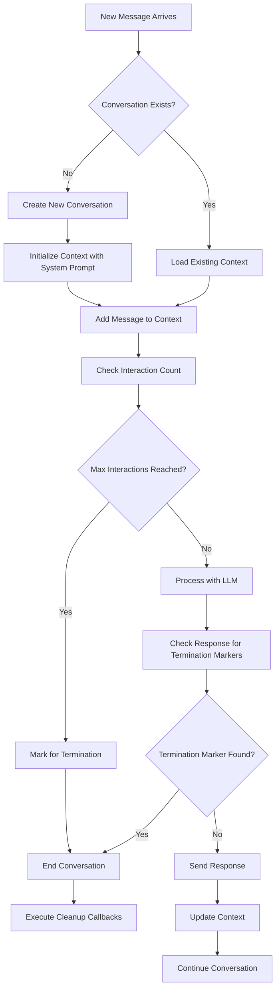

# Conversation Management

SPADE_LLM **automatically manages conversation context** across multi-turn interactions, enabling _stateful dialogues_ between agents.

## Conversation Flow



## Overview

The **conversation system** provides comprehensive management for multi-agent interactions:

- **Multi-turn Context**: Maintains _complete conversation history_ across interactions
- **Concurrent Conversations**: Supports _multiple simultaneous conversations_ per agent  
- **Automatic Lifecycle**: Manages _memory and conversation cleanup_ efficiently
- **Flexible Termination**: Controls _interaction limits and ending conditions_

## Basic Configuration

**Conversation management is automatic**. Each message thread creates a separate conversation with configurable parameters:

```python
from spade_llm import LLMAgent, LLMProvider

agent = LLMAgent(
    jid="assistant@example.com",
    password="password",
    provider=provider,
    system_prompt="You are a helpful assistant",
    max_interactions_per_conversation=10,
    termination_markers=["<DONE>", "<END>"]
)
```

## Conversation Lifecycle

The conversation lifecycle follows a **structured process**:

1. **Initialization**: New conversation created from message thread ID
2. **Processing**: Messages added to context, LLM generates responses
3. **Monitoring**: System tracks interactions and checks termination conditions
4. **Termination**: Conversation ends through various mechanisms
5. **Cleanup**: Resources freed and callbacks executed

### Lifecycle States

- **Active**: Conversation is processing messages normally
- **Approaching Limit**: Near maximum interaction count
- **Terminated**: Conversation has ended and is being cleaned up
- **Cleanup Complete**: All resources have been freed

## Termination Markers

**Termination markers** provide a way for LLMs to _explicitly signal_ when a conversation should end. This enables **intelligent conversation closure** based on content rather than just interaction counts.

### How Termination Markers Work

When the LLM includes a **termination marker** in its response:

1. **Detection**: The system scans the LLM response for configured markers
2. **Immediate Termination**: Conversation is marked for closure regardless of interaction count
3. **Response Processing**: The marker is typically _removed from the final response_ sent to users
4. **Cleanup Execution**: Standard termination procedures are triggered

### Configuration Examples

```python
# Single termination marker
agent = LLMAgent(
    jid="assistant@example.com",
    password="password",
    provider=provider,
    termination_markers=["<CONVERSATION_END>"]
)

# Multiple termination markers
agent = LLMAgent(
    jid="assistant@example.com", 
    password="password",
    provider=provider,
    termination_markers=["<DONE>", "<END>", "<GOODBYE>", "<TERMINATE>"]
)
```

### LLM Integration

Train your LLM to use termination markers appropriately:

```python
system_prompt = """
You are a helpful assistant. When a conversation naturally comes to an end 
or the user says goodbye, include <DONE> at the end of your response to 
properly close the conversation.

Example:
User: "Thanks for your help, goodbye!"
Assistant: "You're welcome! Have a great day! <DONE>"
"""

agent = LLMAgent(
    jid="assistant@example.com",
    password="password",
    provider=provider,
    system_prompt=system_prompt,
    termination_markers=["<DONE>"]
)
```

### Termination Marker Best Practices

- **Choose Unique Markers**: Use markers unlikely to appear in normal conversation
- **Document for LLMs**: Clearly instruct the LLM when and how to use markers
- **Multiple Options**: Provide several markers for different termination scenarios
- **Consistent Format**: Use consistent marker syntax across your system

## Context Management

SPADE_LLM provides **context management** to control conversation memory and optimize performance. See the **[Context Management Guide](context-management.md)** for detailed information.

### Accessing Conversation State

**Programmatic access** to conversation information:

```python
# Get conversation state
conversation_id = "user1_session"
state = agent.get_conversation_state(conversation_id)

# Check conversation status
is_active = state.get("active", False)
interaction_count = state.get("interaction_count", 0)
max_interactions = state.get("max_interactions", 10)

# Reset conversation (removes limits)
success = agent.reset_conversation(conversation_id)
```

### Context Strategy Configuration

**Configure different context management strategies**:

```python
from spade_llm.context import SmartWindowSizeContext

# Context management
smart_context = SmartWindowSizeContext(
    max_messages=20,
    preserve_initial=3,
    prioritize_tools=True
)

# Use with agent
agent = LLMAgent(
    jid="coder@example.com",
    password="password",
    provider=provider,
    context_management=smart_context
)
```

## Conversation Control

### Termination Callbacks

**Handle conversation endings** with custom logic:

```python
def on_conversation_end(conversation_id: str, reason: str):
    """Called when conversation terminates."""
    print(f"Conversation {conversation_id} ended: {reason}")
    
    # Possible reasons:
    # - "max_interactions_reached"
    # - "termination_marker_found" 
    # - "manual_termination"
    
    # Custom cleanup logic
    save_conversation_log(conversation_id)
    send_completion_notification(conversation_id)

agent = LLMAgent(
    jid="assistant@example.com",
    password="password", 
    provider=provider,
    max_interactions_per_conversation=5,
    on_conversation_end=on_conversation_end
)
```

## Best Practices

### Context Design
- Use **clear, focused system prompts** that explain the agent's role
- Set **appropriate interaction limits** based on expected conversation length
- Implement **proper cleanup callbacks** for resource management
- **Handle termination gracefully** with user-friendly messages

### Performance Optimization
- **Monitor memory usage** for long-running conversations
- Implement **context compression** when approaching token limits
- Use **conversation limits** to prevent runaway interactions
- **Clean up inactive conversations** regularly to free resources

### Termination Strategy
- **Train LLMs** to recognize natural conversation endings
- **Use multiple termination markers** for different scenarios
- **Combine markers with interaction limits** for reliable termination
- **Test termination behavior** thoroughly in different conversation contexts


## Next Steps

- **[Context Management](context-management.md)** - Context control strategies
- **[Memory System](memory.md)** - Agent memory and learning capabilities
- **[Tools System](tools-system.md)** - Add capabilities to conversations
- **[Message Routing](routing.md)** - Control conversation flow between agents
- **[Architecture](architecture.md)** - Understanding conversation management internals
- **[Providers](providers.md)** - Configure LLM providers for conversations
