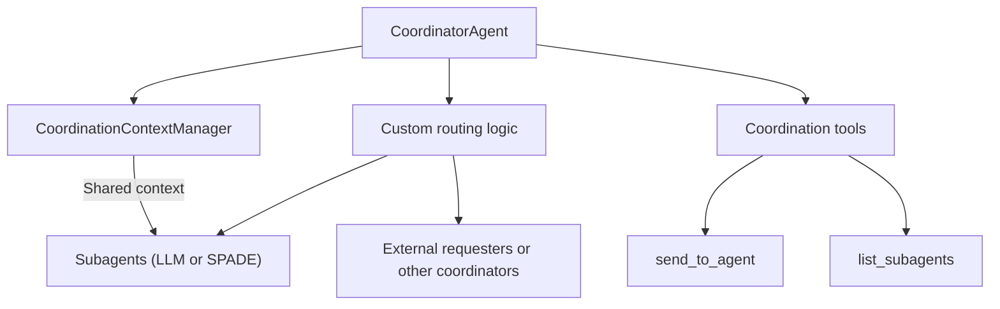
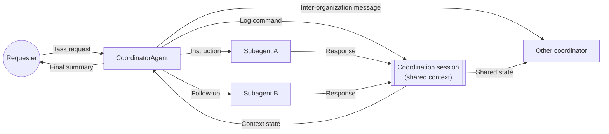
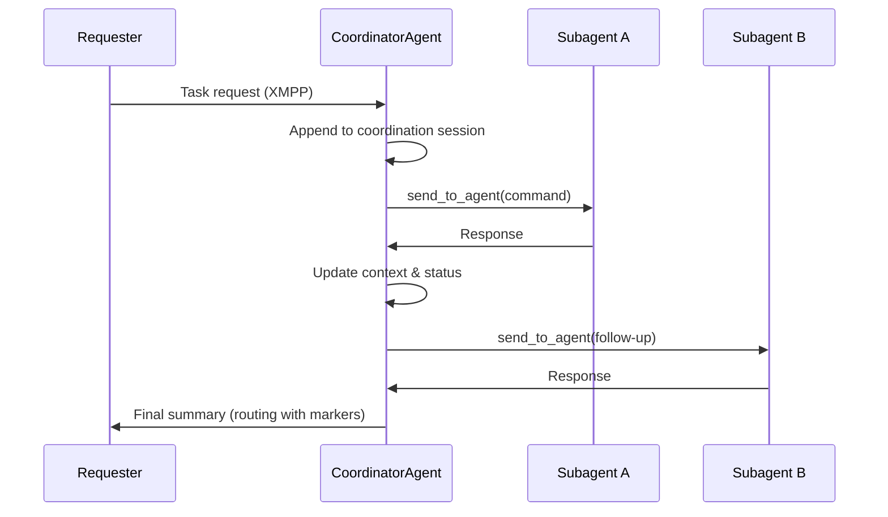

# Coordinator Agent

SPADE\_LLM provides the `CoordinatorAgent` class to orchestrate multiple SPADE entities from a single LLM-driven agent while maintaining a consolidated view of organizational activity.

## Overview

The coordinator:

- **Centralizes context** for all subagents through a shared coordination session.
- **Controls routing** so internal replies return to the coordinator and external results reach the original requester.
- **Adds coordination tools** that allow the LLM to send sequential commands and inspect subagent status.
- **Tracks execution** with timeouts and termination markers (`<TASK_COMPLETE>`, `<END>`, `<DONE>`).

## Architecture



- **CoordinationContextManager** forces every message involving subagents to use the same thread, giving the LLM full visibility of the organizational state.
- **Custom routing** keeps intermediate messages inside the organization and returns the final outcome to the requester.
- **Coordination tools** expose actions that the LLM can trigger (send commands, check registry) without leaving the conversation loop.
- **Status tracking** maintains the latest response state for each subagent so the LLM can decide the next action.

### Shared Coordination Session



This view highlights how every exchange is recorded in the shared session so the coordinator and any collaborating coordinators can access the complete organizational context.

## Coordination Flow



- Messages between the coordinator and subagents share the same `coordination_session` thread.
- Each response is logged in the shared context before the next instruction is issued.
- When a termination marker appears, the routing function forwards the final message to the original requester.

## Built-in Tools

| Tool | Description | Notes |
|------|-------------|-------|
| `send_to_agent` | Sends a command to a registered subagent and waits for the reply within the coordination timeout. | Updates the shared context so subsequent steps can reuse the result. |
| `list_subagents` | Lists the registered subagents and their last known status. | Useful for planning the next action or diagnosing timeouts. |

Both tools are registered automatically during `setup()` and are available to the LLM without extra configuration.

## Setup Example

```python
from spade_llm.agent import CoordinatorAgent
from spade_llm.providers import LLMProvider

subagents = [
    "traffic-analyzer@xmpp.local",
    "notification-service@xmpp.local",
    "logistics-planner@xmpp.local",
]

coordinator = CoordinatorAgent(
    jid="city-coordinator@xmpp.local",
    password="secret",
    subagent_ids=subagents,
    provider=LLMProvider.create_openai(
        api_key="sk-...",
        model="gpt-4o-mini",
    ),
    coordination_session="valencia_city_ops"
)
await coordinator.start()
```

### Best Practices

- **Provide self-contained commands**: Subagents only see their individual thread, so include all necessary context in each instruction.
- **Monitor timeouts**: `send_to_agent` returns an error when the configured timeout is reached; update `_response_timeout` if longer operations are expected.
- **Combine with guardrails/HITL**: The coordinator inherits all safety mechanisms from `LLMAgent`; use them to supervise sensitive exchanges.
- **Persist organizational state**: Pair the coordinator with interaction or base memories when long-running collaborations are required.
