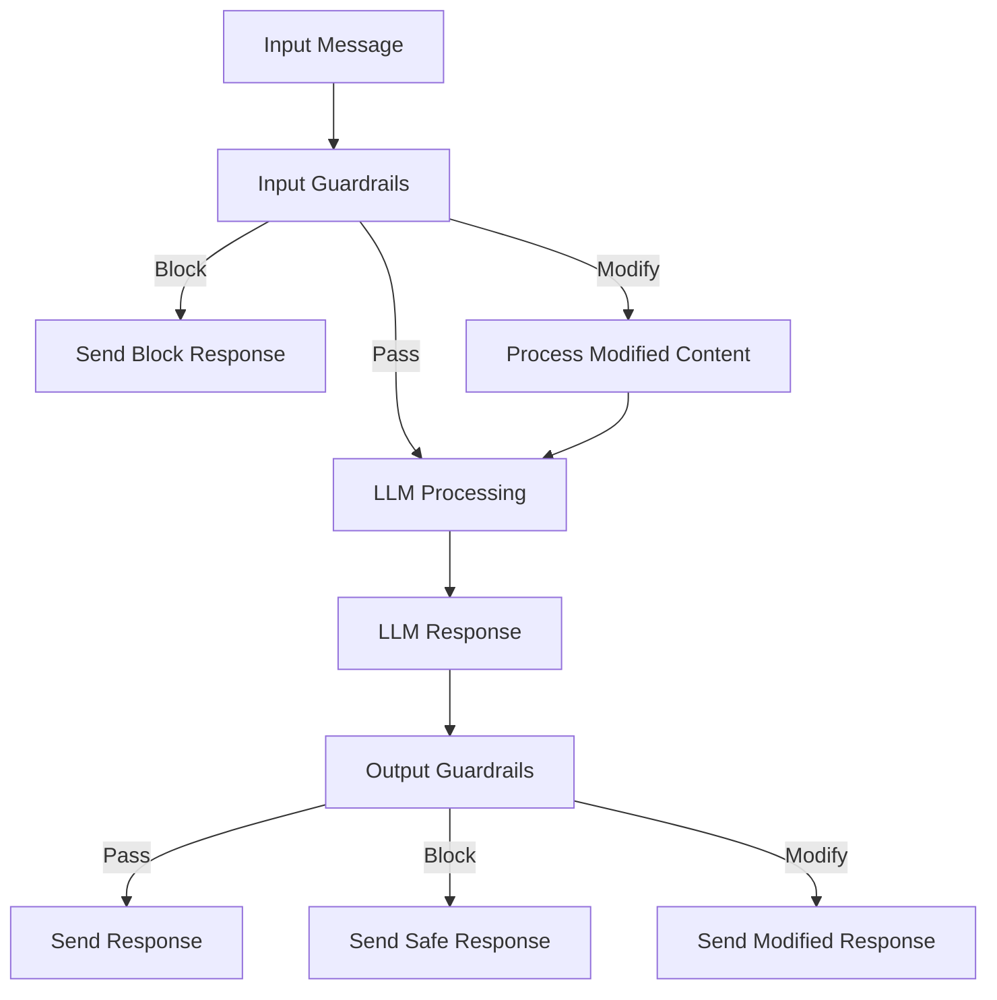

# Guardrails System

Protect your agents with **configurable content filtering** and **safety controls**.

## Content Flow



## Overview

The **Guardrails System** provides _multi-layer content protection_ for your LLM agents. It enables you to:

- **🛡️ Filter harmful content** before it reaches the LLM
- **🔍 Validate LLM responses** before sending to users
- **✏️ Automatically modify** inappropriate content
- **📊 Monitor and log** security events
- **🔗 Chain multiple filters** in sequence

## How Guardrails Work

Guardrails operate at **two critical points** in the agent workflow:

1. **_Input Guardrails_**: Process incoming messages before LLM processing
2. **_Output Guardrails_**: Validate LLM responses before sending to users

Each guardrail can take one of four actions:

- **PASS**: Allow content without changes
- **MODIFY**: Transform content and continue processing
- **BLOCK**: Stop processing and send rejection message
- **WARNING**: Log concern but allow content

## Basic Usage

```python
from spade_llm import LLMAgent, LLMProvider
from spade_llm.guardrails import KeywordGuardrail, GuardrailAction

# Create content filter
safety_filter = KeywordGuardrail(
    name="safety_filter",
    blocked_keywords=["hack", "exploit", "malware"],
    action=GuardrailAction.BLOCK,
    blocked_message="I cannot help with potentially harmful activities."
)

# Apply to agent
agent = LLMAgent(
    jid="assistant@example.com",
    password="password",
    provider=provider,
    input_guardrails=[safety_filter]
)
```

## Built-in Guardrails

### **🔤 KeywordGuardrail**
Block or modify content containing specific keywords.

```python
from spade_llm.guardrails import KeywordGuardrail, GuardrailAction

# Block harmful keywords
block_filter = KeywordGuardrail(
    name="harmful_content",
    blocked_keywords=["bomb", "hack", "exploit"],
    action=GuardrailAction.BLOCK,
    case_sensitive=False
)

# Replace profanity
profanity_filter = KeywordGuardrail(
    name="profanity_filter",
    blocked_keywords=["damn", "hell", "stupid"],
    action=GuardrailAction.MODIFY,
    replacement="[FILTERED]",
    case_sensitive=False
)
```

### **🔍 RegexGuardrail**
Apply regex patterns for sophisticated content detection.

```python
from spade_llm.guardrails import RegexGuardrail, GuardrailAction

# Redact email addresses
email_filter = RegexGuardrail(
    name="email_redactor",
    patterns={
        r'\b[A-Za-z0-9._%+-]+@[A-Za-z0-9.-]+\.[A-Z|a-z]{2,}\b': '[EMAIL]',
        r'\b\d{3}-\d{2}-\d{4}\b': '[SSN]'  # Social Security Numbers
    }
)

# Block credit card patterns
cc_filter = RegexGuardrail(
    name="credit_card_blocker",
    patterns={
        r'\b\d{4}[\s-]?\d{4}[\s-]?\d{4}[\s-]?\d{4}\b': GuardrailAction.BLOCK
    },
    blocked_message="Credit card information is not allowed."
)
```

### **🤖 LLMGuardrail**
Use a smaller LLM model to validate content safety.

```python
from spade_llm.guardrails import LLMGuardrail
from spade_llm.providers import LLMProvider

# Create safety validation model
safety_provider = LLMProvider.create_openai(
    api_key="your-key",
    model="gpt-3.5-turbo",
    temperature=0.1
)

safety_checker = LLMGuardrail(
    name="ai_safety_validator",
    provider=safety_provider,
    safety_prompt="""
    Analyze this text for harmful content including violence, harassment, 
    illegal activities, or inappropriate requests.
    
    Respond with JSON: {"safe": true/false, "reason": "explanation if unsafe"}
    
    Text: {content}
    """,
    blocked_message="This content was flagged by our safety system."
)
```

### **⚙️ CustomFunctionGuardrail**
Create custom validation logic with your own functions.

```python
from spade_llm.guardrails import CustomFunctionGuardrail, GuardrailResult, GuardrailAction

def business_hours_check(content: str, context: dict) -> GuardrailResult:
    """Only allow certain requests during business hours."""
    from datetime import datetime
    
    current_hour = datetime.now().hour
    
    if "urgent" in content.lower() and not (9 <= current_hour <= 17):
        return GuardrailResult(
            action=GuardrailAction.MODIFY,
            content=content + " [Note: Non-business hours - response may be delayed]",
            reason="Added business hours notice"
        )
    
    return GuardrailResult(action=GuardrailAction.PASS, content=content)

hours_filter = CustomFunctionGuardrail(
    name="business_hours",
    check_function=business_hours_check
)
```

## Input vs Output Guardrails

### **Input Guardrails**
Applied to _incoming messages_ before LLM processing.

```python
from spade_llm.guardrails import KeywordGuardrail, RegexGuardrail

input_filters = [
    KeywordGuardrail("safety", ["hack", "exploit"], GuardrailAction.BLOCK),
    RegexGuardrail("pii", {r'\b\d{3}-\d{2}-\d{4}\b': '[SSN]'})
]

agent = LLMAgent(
    jid="assistant@example.com",
    password="password",
    provider=provider,
    input_guardrails=input_filters  # Process incoming messages
)
```

### **Output Guardrails**
Applied to _LLM responses_ before sending to users.

```python
output_filters = [
    LLMGuardrail("safety_check", safety_provider),
    KeywordGuardrail("sensitive_info", ["password", "token"], GuardrailAction.BLOCK)
]

agent = LLMAgent(
    jid="assistant@example.com", 
    password="password",
    provider=provider,
    output_guardrails=output_filters  # Validate LLM responses
)
```

## Composite Guardrails

Chain multiple guardrails together for **sophisticated filtering pipelines**.

```python
from spade_llm.guardrails import CompositeGuardrail

# Create filtering pipeline
content_pipeline = CompositeGuardrail(
    name="content_security_pipeline",
    guardrails=[
        KeywordGuardrail("profanity", ["damn", "hell"], GuardrailAction.MODIFY, "[CENSORED]"),
        RegexGuardrail("emails", {r'[\w\.-]+@[\w\.-]+': '[EMAIL]'}),
        LLMGuardrail("safety", safety_provider)
    ],
    stop_on_block=True  # Stop at first block
)

agent = LLMAgent(
    jid="assistant@example.com",
    password="password", 
    provider=provider,
    input_guardrails=[content_pipeline]
)
```

## Dynamic Control

Control guardrails at runtime for different scenarios.

```python
# Create guardrail
safety_filter = KeywordGuardrail("safety", ["hack"], GuardrailAction.BLOCK)

# Add to agent
agent.add_input_guardrail(safety_filter)

# Control at runtime
if debug_mode:
    safety_filter.enabled = False  # Disable for testing
    
if high_security_mode:
    safety_filter.enabled = True   # Enable for production
```


## **Development vs Production**
```python
# Development: Relaxed filtering
dev_guardrails = [
    KeywordGuardrail("basic", ["exploit"], GuardrailAction.WARNING)
]

# Production: Strict filtering  
prod_guardrails = [
    KeywordGuardrail("security", ["hack", "exploit", "malware"], GuardrailAction.BLOCK),
    LLMGuardrail("ai_safety", safety_provider),
    RegexGuardrail("pii", pii_patterns)
]

guardrails = prod_guardrails if ENVIRONMENT == "production" else dev_guardrails
```


## Next Steps

- **[API Reference](../reference/api/guardrails.md)** - Complete API documentation
- **[Tools System](tools-system.md)** - Function calling capabilities  
- **[Architecture](architecture.md)** - Understanding system design
- **[Examples](../reference/examples.md)** - Working code examples
