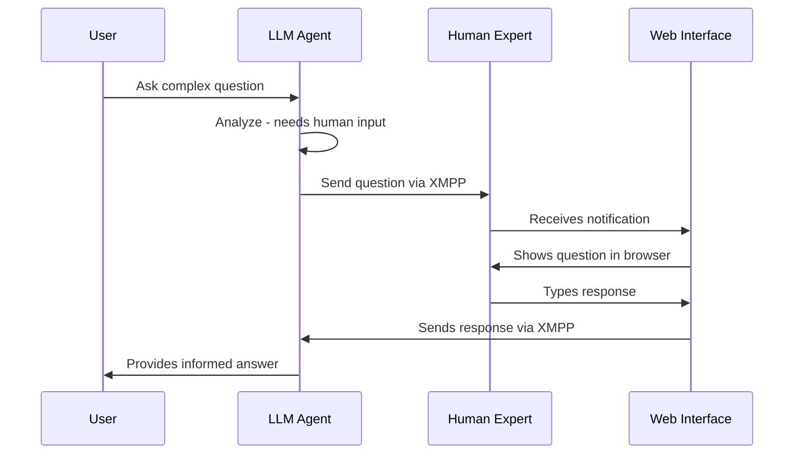

# Human-in-the-Loop

Enable LLM agents to **consult with human experts** during their reasoning process.

## Overview

The Human-in-the-Loop system allows LLM agents to ask questions to human experts when they need:

- **🧠 Human judgment** or subjective opinions
- **📊 Real-time information** not in their training data  
- **🏢 Company-specific knowledge** or proprietary information
- **❓ Clarification** on ambiguous requests
- **✅ Verification** of important decisions

The system maintains the conversational flow while seamlessly integrating human expertise.

## How It Works



## Quick Start

### 1. Create the Tool

```python
from spade_llm.tools import HumanInTheLoopTool

# Create human consultation tool
human_tool = HumanInTheLoopTool(
    human_expert_jid="expert@xmpp.server",
    timeout=300.0,  # 5 minutes
    name="ask_human_expert",
    description="Ask human expert for current info or clarification"
)
```

### 2. Add to Agent

```python
from spade_llm.agent import LLMAgent
from spade_llm.providers import LLMProvider

# Create LLM agent with human tool
agent = LLMAgent(
    jid="agent@xmpp.server", 
    password="password",
    provider=LLMProvider.create_openai(api_key="sk-..."),
    tools=[human_tool],  # Include the human tool
    system_prompt="""You are an AI assistant with access to a human expert.
    When you need current information, human judgment, or clarification,
    use the ask_human_expert tool."""
)
```

### 3. Start Web Interface

```bash
# Start the human expert web interface
python -m spade_llm.human_interface.web_server

# Open browser to http://localhost:8080
# Connect with expert credentials
```

### 4. Test the Integration

```python
# Chat agent for testing
chat_agent = ChatAgent(
    jid="user@xmpp.server",
    password="password", 
    target_agent_jid="agent@xmpp.server"
)

await chat_agent.start()
await agent.start()

# Test questions that trigger human consultation
await chat_agent.run_interactive()
```

## System Requirements

### XMPP Server Setup

You need an XMPP server with WebSocket support:

=== "OpenFire"
    ```bash
    # Install OpenFire with HTTP File Upload and WebSocket plugins
    # Configure WebSocket on port 7070
    # Create user accounts for agents and human experts
    ```

=== "ejabberd"
    ```yaml
    # ejabberd.yml configuration
    listen:
      - port: 7070
        module: ejabberd_http
        request_handlers:
          "/ws": ejabberd_http_ws
    ```

### User Accounts

Create XMPP accounts for:

- **Agent accounts**: `agent1@server`, `agent2@server`, etc.
- **Human experts**: `expert1@server`, `expert2@server`, etc.  
- **Chat users**: `user1@server`, `user2@server`, etc.

## Configuration Options

### Tool Parameters

```python
HumanInTheLoopTool(
    human_expert_jid="expert@server",  # Required: Expert's XMPP address
    timeout=300.0,                     # Optional: Response timeout (seconds)
    name="ask_human_expert",           # Optional: Tool name for LLM
    description="Custom description"   # Optional: When to use this tool
)
```

### System Prompt Guidelines

Help the LLM know when to consult humans:

```python
system_prompt = """You are an AI assistant with access to human experts.

Use the ask_human_expert tool when you need:
- Current information not in your training data (after April 2024)
- Human opinions or subjective judgments
- Company-specific policies or procedures  
- Clarification on ambiguous requests
- Verification of important decisions

Always explain when you're using human vs. AI knowledge."""
```

## Web Interface Usage

### Connecting

1. **Open** `http://localhost:8080` in your browser
2. **Enter** XMPP credentials:
   - Service: `ws://your-server:7070/ws/`
   - JID: `expert@your-server`
   - Password: `your-password`
3. **Click** "Connect"

### Handling Queries

When agents ask questions:

1. **Notification** appears in browser
2. **Question details** show:
   - Query ID for tracking
   - Agent asking the question
   - Question text and context
3. **Type response** in text area
4. **Click** "Send Response"

### Expert Features

- **Query filtering**: Show/hide answered queries
- **Real-time notifications**: Browser notifications for new questions
- **Response history**: Track previous interactions
- **Connection status**: Visual connection indicator

## Advanced Usage

### Multiple Expert Routing

```python
# Different experts for different domains
sales_expert = HumanInTheLoopTool(
    human_expert_jid="sales@company.com",
    name="ask_sales_expert", 
    description="Ask sales team about pricing, deals, customers"
)

tech_expert = HumanInTheLoopTool(
    human_expert_jid="tech@company.com",
    name="ask_tech_expert",
    description="Ask technical team about systems, infrastructure"
)

agent = LLMAgent(
    jid="agent@server",
    password="password",
    provider=provider,
    tools=[sales_expert, tech_expert],  # Multiple expert tools
    system_prompt="Choose the right expert based on question domain..."
)
```

### Conditional Human Consultation

```python
system_prompt = """You have access to human experts via ask_human_expert.

Only consult humans when:
1. The question involves information after April 2024
2. You need subjective human judgment  
3. The request is ambiguous and needs clarification
4. The decision has significant business impact

For general knowledge questions, answer directly without consulting humans."""
```

### Error Handling

The system handles common error scenarios:

```python
# Timeout handling
if "Timeout:" in response:
    # Human didn't respond in time
    print("Expert unavailable, proceeding with AI-only response")

# Expert offline  
if "Error:" in response:
    # Connection or configuration issue
    print("Expert consultation failed, using fallback approach")
```

## Troubleshooting

### Common Issues

!!! warning "Agent Connection Errors"
    **Symptom**: `Agent XMPP client not available`
    
    **Solution**: Ensure agent is fully connected before tool execution:
    ```python
    await agent.start()
    await asyncio.sleep(2.0)  # Wait for full connection
    ```

!!! warning "Human Expert Not Responding"
    **Symptom**: Timeouts on human consultation
    
    **Solutions**:
    - Check expert is connected to web interface
    - Verify XMPP server WebSocket configuration
    - Increase timeout in tool configuration

!!! warning "Double Message Processing"
    **Symptom**: Human responses processed as new user messages
    
    **Solution**: This is handled automatically by template-based message filtering

### Debugging

Enable debug logging:

```python
import logging
logging.getLogger("spade_llm.tools.human_in_the_loop").setLevel(logging.DEBUG)
logging.getLogger("spade_llm.behaviour.human_interaction").setLevel(logging.DEBUG)
```

### Network Configuration

For complex networks:

```python
# Custom WebSocket URL for web interface
service_url = "wss://xmpp.company.com:7070/ws/"

# Update web interface connection settings
# Edit spade_llm/human_interface/web_client/index.html
```

## Best Practices

### Expert Availability

- **Set expectations**: Inform users about expert availability hours
- **Fallback strategies**: Plan for when experts are unavailable
- **Response time SLAs**: Set clear expectations for response times

### Question Quality

- **Provide context**: Include relevant background information
- **Be specific**: Ask focused questions rather than broad queries
- **Include urgency**: Indicate if immediate response is needed

### System Reliability

- **Monitor timeouts**: Track expert response patterns
- **Have backup experts**: Multiple experts for critical domains
- **Graceful degradation**: System works even if human consultation fails

## Next Steps

- **[API Reference](../reference/api/human-interface.md)**: Detailed class documentation
- **[Examples](../reference/examples.md)**: Working code examples
- **[Architecture](architecture.md)**: System design details
- **[Tools System](tools-system.md)**: Complete tools documentation