# Memory Architecture

This guide provides detailed architectural diagrams and explanations of SPADE_LLM's memory system components and their interactions.

## System Overview

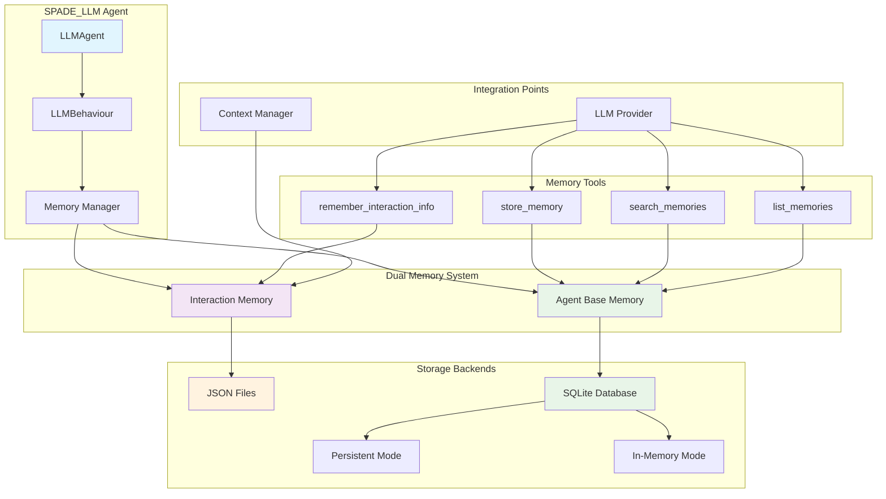

## Memory Types Architecture

### Interaction Memory Flow

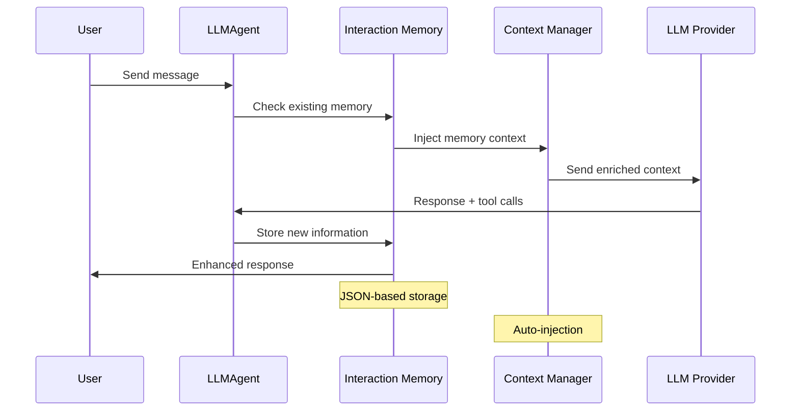

### Agent Base Memory Flow

#### Persistent Mode
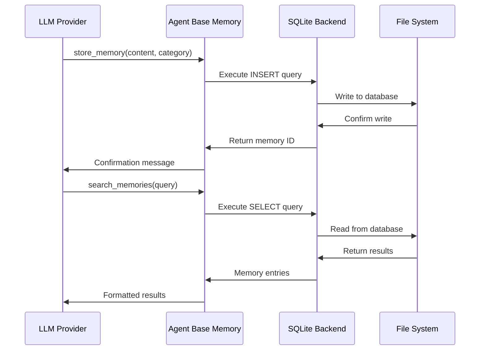

#### In-Memory Mode
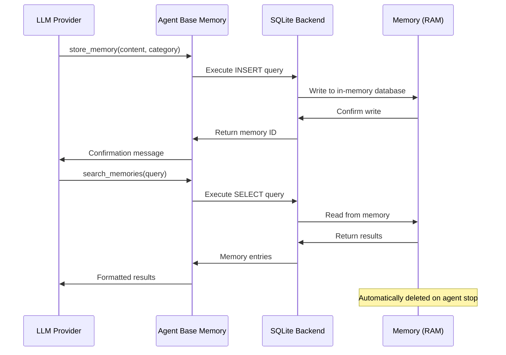

## Data Storage Architecture

### File System Organization

#### Persistent Storage
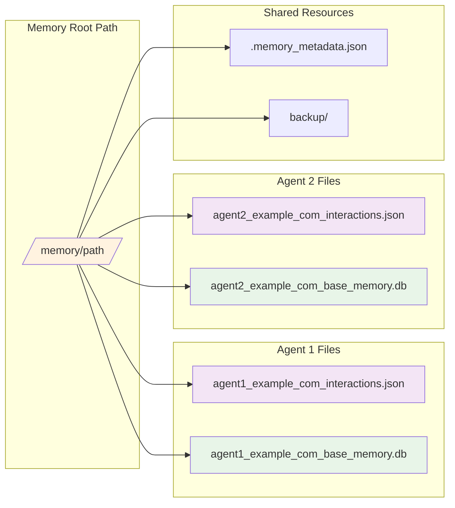

#### In-Memory Storage
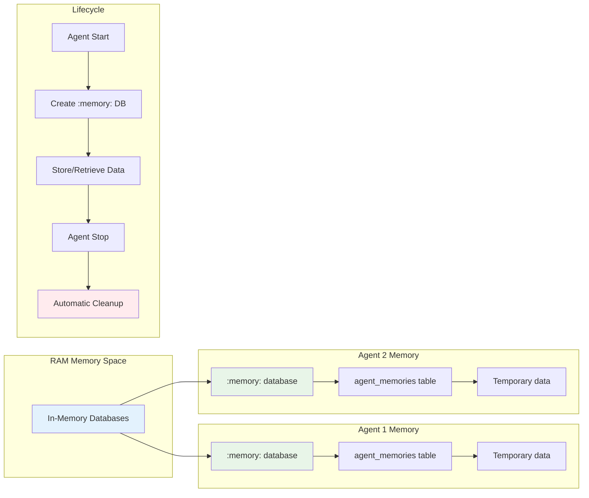

### Database Schema Architecture

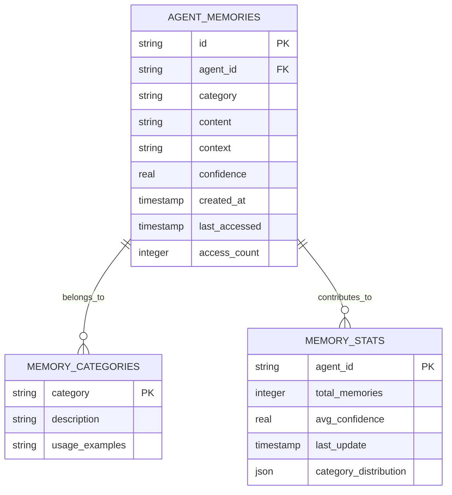

## Memory Tool Integration

### Tool Registration Flow

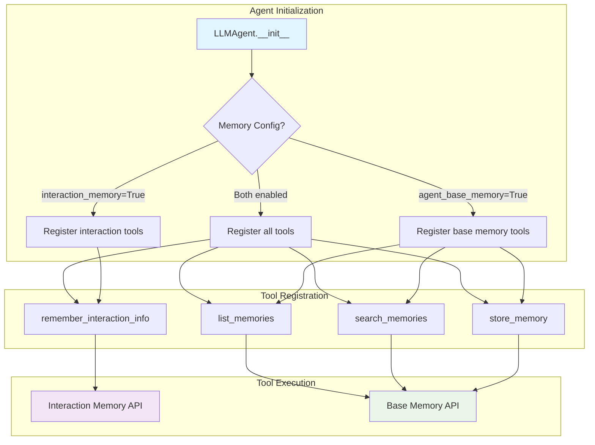

### Tool Call Processing

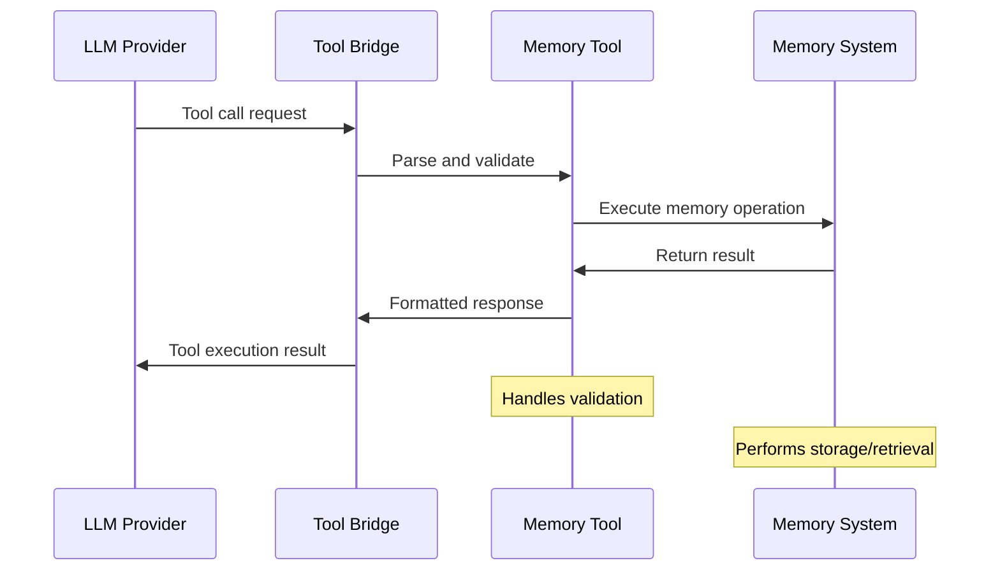

## Memory Categories System

### Category Organization

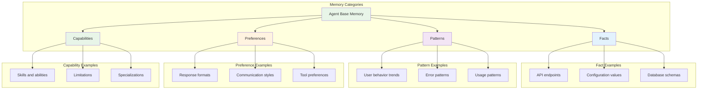

## Context Integration

### Agent interaction Memory Context Injection

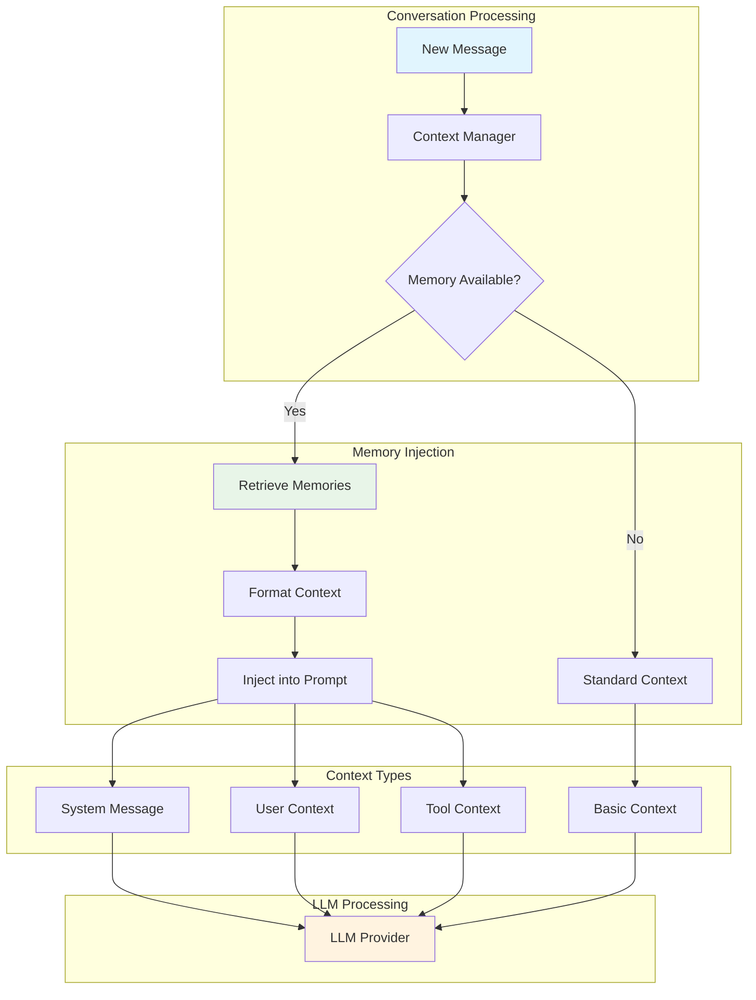

## Multi-Agent Memory Architecture

### Agent Memory Isolation

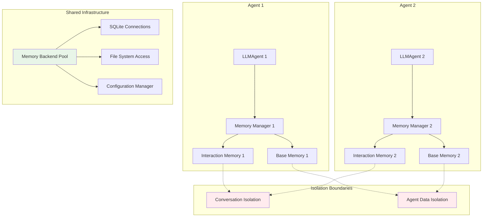

## Next Steps

- **[Memory System Guide](memory.md)** - Complete memory system documentation
- **[API Reference](../reference/api/memory.md)** - Detailed API documentation