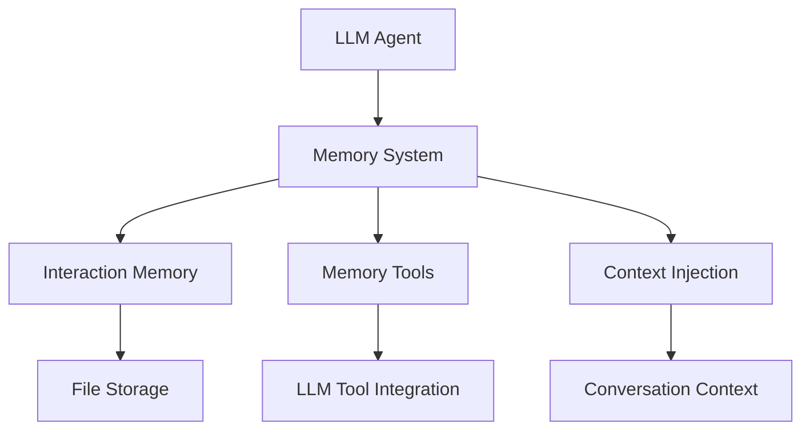

# Memory System

SPADE_LLM provides **agent memory capabilities** that enable agents to learn from interactions and maintain knowledge across conversations.

## Overview

The **memory system** allows agents to:

- **Remember Information**: Store and retrieve interaction details
- **Learn from Conversations**: Build knowledge base from agent interactions
- **Contextual Recall**: Access relevant information in future conversations
- **Tool Integration**: LLMs can autonomously store and retrieve memories

## Architecture



## Agent Interaction Memory

The **AgentInteractionMemory** system provides basic memory capabilities for agent-to-agent interactions.

### Key Features

- **Conversation-Specific**: Memory isolated by conversation ID
- **JSON Storage**: File-based storage for persistence
- **Auto-Injection**: Memory automatically added to conversation context
- **Tool Integration**: LLMs can store information using tools

### Basic Configuration

```python
from spade_llm.agent import LLMAgent
from spade_llm.providers import LLMProvider

# Enable interaction memory
agent = LLMAgent(
    jid="memory_agent@example.com",
    password="password",
    provider=provider,
    interaction_memory=True,  # Enable memory
    system_prompt="You are an assistant with memory capabilities."
)
```

### Storage Architecture

**File Location**: `spade_llm/data/agent_memory/{agent_id}_interactions.json`

**Storage Format**:
```json
{
    "agent_id": "memory_agent@example.com",
    "interactions": {
        "conversation_id_1": [
            {
                "content": "User prefers API authentication with token db_token_123",
                "timestamp": "2025-01-09T10:30:00.000Z"
            }
        ],
        "conversation_id_2": [
            {
                "content": "Database connection requires SSL enabled",
                "timestamp": "2025-01-09T11:15:00.000Z"
            }
        ]
    }
}
```

## Memory Tools Integration

The system includes **memory tools** that LLMs can use to store and retrieve information.

### Available Tools

#### remember_interaction_info

**Function**: Store important information for future reference

```python
# LLM can call this tool
{
    "name": "remember_interaction_info",
    "description": "Store important information about this interaction",
    "parameters": {
        "information": "API requires authentication token db_token_123"
    }
}
```

#### get_interaction_history

**Function**: Retrieve previous interaction information

```python
# LLM can call this tool
{
    "name": "get_interaction_history", 
    "description": "Get previous interaction information",
    "parameters": {}
}
```

### Automatic Context Injection

Memory is **automatically injected** into conversations as system messages:

```python
# Example injected system message
{
    "role": "system",
    "content": "Previous interactions with this user:\n- API requires token db_token_123\n- Database connection needs SSL enabled"
}
```

## Conversation Threading

The memory system integrates with **conversation threading** to maintain context across sessions.

### Thread ID Generation

```python
# Conversation ID determined from:
conversation_id = msg.thread or f"{msg.sender}_{msg.to}"
```

### Conversation States

- **Active**: Conversation is processing messages
- **Completed**: Conversation ended normally
- **Error**: Conversation terminated due to error
- **Timeout**: Conversation exceeded time limits
- **Max Interactions Reached**: Hit interaction limit

### Lifecycle Management

```python
# Conversation state tracking
{
    "conversation_id": "user1_session",
    "state": "active",
    "interaction_count": 5,
    "max_interactions": 10,
    "created_at": "2025-01-09T10:00:00Z",
    "last_interaction": "2025-01-09T10:30:00Z"
}
```

## Usage Examples

### Basic Memory Usage

```python
import asyncio
from spade_llm.agent import LLMAgent
from spade_llm.providers import LLMProvider

async def memory_example():
    # Create agent with memory
    agent = LLMAgent(
        jid="memory_agent@example.com",
        password="password",
        provider=provider,
        interaction_memory=True,
        system_prompt="You can remember important information from our conversations."
    )
    
    await agent.start()
    
    # Memory is automatically used in conversations
    # LLM can call remember_interaction_info to store data
    # Memory is auto-injected in future conversations
    
    await agent.stop()
```

### Memory with Routing

```python
from spade_llm.routing import conditional_routing

def api_agent_router(message_content: str) -> str:
    """Route queries to appropriate agents"""
    if "database" in message_content.lower():
        return "database_agent@example.com"
    elif "api" in message_content.lower():
        return "api_agent@example.com"
    return "general_agent@example.com"

# API agent with memory
api_agent = LLMAgent(
    jid="api_agent@example.com",
    password="password",
    provider=provider,
    interaction_memory=True,  # Memory enabled
    routing_function=api_agent_router
)
```

### Memory Flow Example

```python
# 1. User asks about database connection
# 2. Agent routes to database specialist
# 3. Database agent responds with config info
# 4. Agent calls remember_interaction_info("Database uses SSL config X")
# 5. Later conversation about database automatically includes stored info
```

## Advanced Configuration

### Custom Memory Directory

```python
from spade_llm.memory import AgentInteractionMemory

# Custom storage location
memory = AgentInteractionMemory(
    agent_id="custom_agent@example.com",
    storage_dir="/custom/memory/path"
)
```

### Memory Operations

```python
# Direct memory operations
memory = AgentInteractionMemory("agent@example.com")

# Add information
memory.add_information("conv_1", "User prefers JSON responses")

# Get information
info_list = memory.get_information("conv_1")

# Get context summary
summary = memory.get_context_summary("conv_1")

# Clear conversation memory
success = memory.clear_conversation("conv_1")
```

### Integration with Context Management

```python
from spade_llm.context import SmartWindowSizeContext

# Memory works with context management
smart_context = SmartWindowSizeContext(
    max_messages=20,
    preserve_initial=3,  # Preserves initial context
    prioritize_tools=True  # Prioritizes memory tool results
)

agent = LLMAgent(
    jid="smart_memory_agent@example.com",
    password="password",
    provider=provider,
    interaction_memory=True,  # Memory enabled
    context_management=smart_context  # Smart context management
)
```

## Memory Patterns

### Learning Agent Pattern

```python
async def learning_agent_example():
    """Agent that learns user preferences over time"""
    
    learning_agent = LLMAgent(
        jid="learning_agent@example.com",
        password="password",
        provider=provider,
        interaction_memory=True,
        system_prompt="""
        You are a learning assistant. Remember important user preferences,
        settings, and information for future interactions. Use the
        remember_interaction_info tool to store key details.
        """
    )
    
    await learning_agent.start()
    # Agent learns and remembers across conversations
    await learning_agent.stop()
```

### Knowledge Base Pattern

```python
async def knowledge_base_example():
    """Agent that builds domain-specific knowledge"""
    
    kb_agent = LLMAgent(
        jid="kb_agent@example.com",
        password="password",
        provider=provider,
        interaction_memory=True,
        system_prompt="""
        You are a knowledge base agent. Store important facts,
        procedures, and domain knowledge using remember_interaction_info.
        Reference stored knowledge in future conversations.
        """
    )
    
    await kb_agent.start()
    # Agent builds and uses knowledge base
    await kb_agent.stop()
```

### Multi-Agent Memory Sharing

```python
async def shared_memory_example():
    """Multiple agents sharing conversation context"""
    
    # Database specialist with memory
    db_agent = LLMAgent(
        jid="db_agent@example.com",
        password="password",
        provider=provider,
        interaction_memory=True,
        system_prompt="Database specialist with memory"
    )
    
    # API specialist with memory
    api_agent = LLMAgent(
        jid="api_agent@example.com", 
        password="password",
        provider=provider,
        interaction_memory=True,
        system_prompt="API specialist with memory"
    )
    
    # Each agent maintains its own memory
    # Memory is conversation-specific
    await db_agent.start()
    await api_agent.start()
```


## Troubleshooting

### Common Issues

#### Memory Not Persisting
- Check file permissions in `spade_llm/data/agent_memory/`
- Verify `interaction_memory=True` in agent configuration
- Ensure proper conversation ID generation

#### Memory Not Loading
- Current implementation requires manual loading
- Check file existence and JSON format
- Verify agent ID matches filename

#### Performance Issues
- Monitor memory file sizes
- Implement periodic cleanup
- Consider moving to database backend

### Debug Mode

```python
import logging

# Enable debug logging
logging.basicConfig(level=logging.DEBUG)

# Agent will log memory operations
agent = LLMAgent(
    jid="debug_agent@example.com",
    password="password",
    provider=provider,
    interaction_memory=True
)
```

## Complete Example

```python
import asyncio
from spade_llm.agent import LLMAgent
from spade_llm.providers import LLMProvider
from spade_llm.context import SmartWindowSizeContext

async def complete_memory_example():
    # Configure context management
    smart_context = SmartWindowSizeContext(
        max_messages=20,
        preserve_initial=2,
        prioritize_tools=True
    )
    
    # Create provider
    provider = LLMProvider.create_openai(
        api_key="your-api-key",
        model="gpt-4"
    )
    
    # Create agent with memory and smart context
    agent = LLMAgent(
        jid="memory_agent@example.com",
        password="password",
        provider=provider,
        interaction_memory=True,  # Enable memory
        context_management=smart_context,  # Smart context
        system_prompt="""
        You are an intelligent assistant with memory capabilities.
        
        You can remember important information using the remember_interaction_info tool.
        This information will be available in future conversations.
        
        Use memory to provide better, more personalized assistance.
        """
    )
    
    await agent.start()
    
    # Agent now has:
    # - Memory capabilities
    # - Smart context management
    # - Tool integration
    # - Automatic context injection
    
    print("Agent started with memory capabilities")
    
    # Keep agent running
    await asyncio.sleep(3600)  # Run for 1 hour
    
    await agent.stop()

if __name__ == "__main__":
    asyncio.run(complete_memory_example())
```

## Next Steps

- **[Context Management](context-management.md)** - Advanced context control strategies
- **[Conversations](conversations.md)** - Conversation lifecycle management
- **[Tools System](tools-system.md)** - Tool integration and capabilities
- **[API Reference](../reference/api/memory.md)** - Detailed memory API documentation