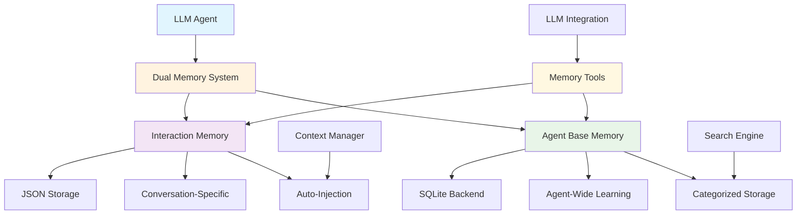

# Memory System

SPADE_LLM provides a dual memory architecture that enables agents to learn from interactions and maintain knowledge across conversations.

## Overview

The memory system allows agents to:

- **Store Information**: Persist data across conversations and agent restarts
- **Learn from Experience**: Build knowledge from interactions over time
- **Categorize Knowledge**: Organize information into facts, patterns, preferences, and capabilities
- **Search Memories**: Find relevant information using search capabilities
- **Tool Integration**: LLMs can store and retrieve memories using built-in tools

## Architecture



## Memory Types

### 1. Interaction Memory

**Purpose**: Stores conversation-specific information for immediate context enhancement.

**Key Features**:
- **Conversation-scoped**: Memory isolated by conversation ID
- **JSON-based**: Simple file-based storage
- **Auto-injection**: Automatically added to conversation context
- **Temporary**: Designed for conversation-specific details

**Use Cases**:
- User preferences within a conversation
- API tokens or configuration details
- Conversation-specific settings
- Contextual information for current session

### 2. Agent Base Memory

**Purpose**: Provides long-term learning capabilities across all conversations.

**Key Features**:
- **Agent-scoped**: Memory persists across all conversations
- **SQLite backend**: Reliable database storage with search capabilities
- **Flexible Storage**: Choose between persistent file-based or temporary in-memory storage
- **Categorized**: Organized into four memory categories
- **Persistent**: Survives agent restarts and system reboots (file-based mode)
- **Tool integration**: Three auto-registered tools for LLM access

**Memory Categories**:
- **`fact`**: Concrete information (APIs, data formats, configurations)
- **`pattern`**: Behavioral patterns or trends observed
- **`preference`**: User preferences or system settings learned
- **`capability`**: Agent's abilities or limitations discovered

## Configuration

### Basic Setup

```python
from spade_llm.agent import LLMAgent
from spade_llm.providers import LLMProvider

# Interaction memory only
agent = LLMAgent(
    jid="agent@example.com",
    password="password",
    provider=provider,
    interaction_memory=True
)

# Agent base memory only (persistent)
agent = LLMAgent(
    jid="agent@example.com",
    password="password",
    provider=provider,
    agent_base_memory=True
)

# Agent base memory (in-memory, temporary)
agent = LLMAgent(
    jid="test_agent@example.com",
    password="password",
    provider=provider,
    agent_base_memory=(True, ":memory:")
)

# Both memory types
agent = LLMAgent(
    jid="agent@example.com",
    password="password",
    provider=provider,
    interaction_memory=True,
    agent_base_memory=True
)
```

### Custom Memory Paths

```python
# Environment variable (recommended)
import os
os.environ['SPADE_LLM_MEMORY_PATH'] = "/custom/memory/path"

# Constructor parameters
agent = LLMAgent(
    jid="agent@example.com",
    password="password",
    provider=provider,
    interaction_memory=(True, "/custom/interaction/path"),
    agent_base_memory=(True, "/custom/base/memory/path")
)
```

### Memory Path Resolution

Memory paths are resolved in the following order:
1. **Constructor parameter**: `(True, "/custom/path")`
2. **Environment variable**: `SPADE_LLM_MEMORY_PATH`
3. **Default path**: `spade_llm/data/agent_memory/`

## Memory Tools

### Interaction Memory Tools

#### remember_interaction_info

Store information for the current conversation.

```python
# LLM tool call
{
    "name": "remember_interaction_info",
    "parameters": {
        "information": "User prefers JSON responses over XML"
    }
}
```

### Agent Base Memory Tools

#### store_memory

Store information in long-term memory with category classification.

```python
# LLM tool call
{
    "name": "store_memory",
    "parameters": {
        "content": "User authentication requires API key in header",
        "category": "fact",
        "context": "API integration discussion"
    }
}
```

#### search_memories

Search through stored memories for relevant information.

```python
# LLM tool call
{
    "name": "search_memories",
    "parameters": {
        "query": "API authentication",
        "limit": 5
    }
}
```

#### list_memories

List memories by category or view recent memories.

```python
# LLM tool call
{
    "name": "list_memories",
    "parameters": {
        "category": "fact",
        "limit": 10
    }
}
```

## Storage Architecture

### Interaction Memory Storage

**Location**: `{memory_path}/{safe_agent_id}_interactions.json`

**Format**:
```json
{
    "agent_id": "agent@example.com",
    "interactions": {
        "conversation_id": [
            {
                "content": "User prefers JSON responses",
                "timestamp": "2025-01-10T10:30:00.000Z"
            }
        ]
    }
}
```

### Agent Base Memory Storage

#### Persistent Mode (Default)
**Location**: `{memory_path}/{safe_agent_id}_base_memory.db`

#### In-Memory Mode
**Location**: RAM-only (`:memory:` database)

**SQLite Schema** (both modes):
```sql
CREATE TABLE agent_memories (
    id TEXT PRIMARY KEY,
    agent_id TEXT NOT NULL,
    category TEXT NOT NULL,
    content TEXT NOT NULL,
    context TEXT,
    confidence REAL DEFAULT 1.0,
    created_at TIMESTAMP DEFAULT CURRENT_TIMESTAMP,
    last_accessed TIMESTAMP DEFAULT CURRENT_TIMESTAMP,
    access_count INTEGER DEFAULT 0,
    INDEX idx_agent_category (agent_id, category),
    INDEX idx_content_search (content)
);
```

**Storage Modes**:
- **Persistent**: Survives agent restarts, stored in database files
- **In-Memory**: Temporary storage, automatically deleted when agent stops

## Usage Examples

### Basic Memory Usage

```python
import asyncio
from spade_llm.agent import LLMAgent
from spade_llm.providers import LLMProvider

async def basic_memory_example():
    provider = LLMProvider.create_openai(
        api_key="your-api-key",
        model="gpt-4"
    )
    
    agent = LLMAgent(
        jid="learning_agent@example.com",
        password="password",
        provider=provider,
        agent_base_memory=True,
        system_prompt="""You are a learning assistant with memory capabilities.
        
        Use these tools to learn and remember:
        - store_memory: Save important information for future use
        - search_memories: Find relevant information from past conversations
        - list_memories: Browse your stored knowledge by category
        
        Remember facts, patterns, preferences, and capabilities you discover."""
    )
    
    await agent.start()
    print("Agent started with memory capabilities")
    
    # Agent will automatically use memory tools during conversations
    await asyncio.sleep(3600)  # Run for 1 hour
    await agent.stop()

if __name__ == "__main__":
    asyncio.run(basic_memory_example())
```

### Dual Memory Configuration

```python
async def dual_memory_example():
    provider = LLMProvider.create_openai(
        api_key="your-api-key",
        model="gpt-4"
    )
    
    agent = LLMAgent(
        jid="advanced_agent@example.com",
        password="password",
        provider=provider,
        interaction_memory=True,  # Conversation-specific memory
        agent_base_memory=True,   # Long-term learning memory
        system_prompt="""You are an advanced assistant with dual memory systems.
        
        You have access to:
        - Interaction memory: For conversation-specific details
        - Base memory: For long-term learning across all conversations
        
        Use remember_interaction_info for conversation-specific information.
        Use store_memory, search_memories, and list_memories for long-term learning."""
    )
    
    await agent.start()
    print("Agent started with dual memory systems")
    await asyncio.sleep(3600)
    await agent.stop()
```

### Memory-Enabled Multi-Agent System

```python
async def multi_agent_memory_example():
    provider = LLMProvider.create_openai(
        api_key="your-api-key",
        model="gpt-4"
    )
    
    # Database specialist with memory
    db_agent = LLMAgent(
        jid="db_specialist@example.com",
        password="password",
        provider=provider,
        agent_base_memory=True,
        system_prompt="""You are a database specialist with memory capabilities.
        
        Store database facts, patterns, and user preferences.
        Search your memory for relevant database solutions."""
    )
    
    # API specialist with memory
    api_agent = LLMAgent(
        jid="api_specialist@example.com",
        password="password",
        provider=provider,
        agent_base_memory=True,
        system_prompt="""You are an API specialist with memory capabilities.
        
        Remember API patterns, authentication methods, and integration details.
        Use your memory to provide consistent API guidance."""
    )
    
    await db_agent.start()
    await api_agent.start()
    
    print("Multi-agent system with individual memory systems started")
    
    # Each agent maintains its own memory
    await asyncio.sleep(3600)
    
    await db_agent.stop()
    await api_agent.stop()
```

## Memory Categories Guide

### Fact Category

Store concrete, verifiable information.

**Examples**:
- "API endpoint: https://api.example.com/v1/users"
- "Database connection requires SSL on port 5432"
- "User authentication uses JWT tokens"

**Usage**:
```python
store_memory(
    content="API rate limit is 1000 requests per hour",
    category="fact",
    context="API integration requirements"
)
```

### Pattern Category

Store behavioral patterns or trends observed.

**Examples**:
- "Users typically request data in JSON format"
- "Database queries perform better with indexed columns"
- "API failures increase during peak hours"

**Usage**:
```python
store_memory(
    content="Users prefer batch operations over individual requests",
    category="pattern",
    context="API usage optimization"
)
```

### Preference Category

Store user preferences and system settings.

**Examples**:
- "User prefers verbose error messages"
- "System should use UTC timezone"
- "Responses should include example code"

**Usage**:
```python
store_memory(
    content="User prefers Python examples over JavaScript",
    category="preference",
    context="Code example preferences"
)
```

### Capability Category

Store agent abilities and limitations.

**Examples**:
- "Can generate SQL queries for PostgreSQL"
- "Cannot access external APIs without authentication"
- "Specializes in REST API design patterns"

**Usage**:
```python
store_memory(
    content="Can provide database schema optimization recommendations",
    category="capability",
    context="Agent specialization discovery"
)
```

## Advanced Configuration


### Context Management Integration

```python
from spade_llm.context import SmartWindowSizeContext

# Memory works with context management
smart_context = SmartWindowSizeContext(
    max_messages=20,
    preserve_initial=3,
    prioritize_tools=True  # Prioritizes memory tool results
)

agent = LLMAgent(
    jid="smart_memory_agent@example.com",
    password="password",
    provider=provider,
    agent_base_memory=True,
    context_management=smart_context
)
```

## Performance Considerations

### Interaction Memory

**Advantages**:
- Fast file-based operations
- Simple JSON format
- Minimal overhead

**Limitations**:
- File size grows with conversation length
- No search capabilities
- File locking issues with concurrent access

### Agent Base Memory

#### Persistent Mode
**Advantages**:
- Fast SQLite database operations
- Full-text search capabilities
- Concurrent access support
- Structured data storage
- Survives agent restarts

**Limitations**:
- Database file size growth
- Memory queries add latency
- Requires database maintenance

#### In-Memory Mode
**Advantages**:
- Fastest possible operations (no disk I/O)
- Automatic cleanup on agent stop
- No file system pollution
- Perfect for testing and development

**Limitations**:
- No persistence across agent restarts
- Higher memory usage
- Data lost when agent stops


## Next Steps

- **[Context Management](context-management.md)** - Context control strategies
- **[Conversations](conversations.md)** - Conversation lifecycle management
- **[Tools System](tools-system.md)** - Tool integration and capabilities
- **[API Reference](../reference/api/memory.md)** - Detailed memory API documentation