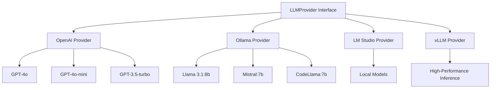

# LLM Providers

SPADE_LLM supports **multiple LLM providers** through a _unified interface_, enabling seamless switching between different AI services.

## Provider Architecture



## Supported Providers

The **unified LLMProvider interface** supports:

- **OpenAI** - GPT models via API for _production-ready_ solutions
- **Ollama** - Local open-source models for _privacy-focused_ deployments  
- **LM Studio** - Local models with GUI for _easy experimentation_
- **vLLM** - High-performance inference server for _scalable applications_

## OpenAI Provider

**Cloud-based LLM service** with state-of-the-art models:

```python
from spade_llm.providers import LLMProvider

provider = LLMProvider.create_openai(
    api_key="your-api-key",
    model="gpt-4o-mini",
    temperature=0.7
)
```

**Popular models**: `gpt-4o`, `gpt-4o-mini`, `gpt-3.5-turbo`

**Key advantages**: _Excellent tool calling_, consistent performance, extensive model options.

## Ollama Provider

**Local deployment** for privacy and control:

```python
provider = LLMProvider.create_ollama(
    model="llama3.1:8b",
    base_url="http://localhost:11434/v1"
)
```

**Popular models**: `llama3.1:8b`, `mistral:7b`, `codellama:7b`

**Tool support**: Available with `llama3.1:8b`, `llama3.1:70b`, `mistral:7b`

**Key advantages**: _Complete privacy_, no internet required, cost-effective for high usage.

## LM Studio Provider

**Local models with GUI** for easy management:

```python
provider = LLMProvider.create_lm_studio(
    model="local-model",
    base_url="http://localhost:1234/v1"
)
```

The model name should **match exactly** what's displayed in the LM Studio interface.

**Key advantages**: _User-friendly interface_, easy model switching, good for experimentation.

## vLLM Provider

**High-performance inference** for production deployments:

```python
provider = LLMProvider.create_vllm(
    model="meta-llama/Llama-2-7b-chat-hf",
    base_url="http://localhost:8000/v1"
)
```

Start vLLM server:
```bash
python -m vllm.entrypoints.openai.api_server \
    --model meta-llama/Llama-2-7b-chat-hf \
    --port 8000
```

**Key advantages**: _Optimized performance_, batching support, scalable architecture.

## Configuration Options

### Environment Variables

**Centralized configuration** using environment variables:

```bash
# .env file
OPENAI_API_KEY=your-key
OLLAMA_BASE_URL=http://localhost:11434/v1
LM_STUDIO_BASE_URL=http://localhost:1234/v1
```

### Dynamic Provider Selection

**Runtime provider switching** based on configuration:

```python
import os

def create_provider():
    provider_type = os.getenv('LLM_PROVIDER', 'openai')
    
    if provider_type == 'openai':
        return LLMProvider.create_openai(
            api_key=os.getenv('OPENAI_API_KEY'),
            model=os.getenv('OPENAI_MODEL', 'gpt-4o-mini')
        )
    elif provider_type == 'ollama':
        return LLMProvider.create_ollama(
            model=os.getenv('OLLAMA_MODEL', 'llama3.1:8b')
        )
```

This approach enables **easy deployment** across different environments without code changes.

## Error Handling

**Robust error handling** for production reliability:

```python
try:
    response = await provider.get_llm_response(context)
except Exception as e:
    logger.error(f"Provider error: {e}")
    # Handle fallback or retry logic
```

## Provider Fallback System

**Automatic failover** for high availability:

```python
providers = [
    LLMProvider.create_openai(api_key="key"),
    LLMProvider.create_ollama(model="llama3.1:8b")
]

async def get_response_with_fallback(context):
    for provider in providers:
        try:
            return await provider.get_llm_response(context)
        except Exception:
            continue
    raise Exception("All providers failed")
```

This pattern ensures **service continuity** even when individual providers experience issues.

## Provider Selection Guide

### **Cloud vs Local**

**Choose OpenAI when**:
- Need _best-in-class_ performance
- Want **consistent reliability**
- Have internet connectivity
- Budget allows for API costs

**Choose Local Providers when**:
- **Privacy** is paramount
- Want _complete control_ over infrastructure
- Have **computational resources**
- Need to minimize ongoing costs

### **Performance Considerations**

**OpenAI**: _Fastest response times_, excellent reasoning capabilities
**Ollama**: Good performance with _smaller models_, privacy benefits
**LM Studio**: _Easy setup_, good for development and testing  
**vLLM**: _Optimized inference_, best for high-throughput applications

### **Tool Calling Support**

**Full tool support**: OpenAI (all models)
**Limited tool support**: Ollama (specific models only)
**Experimental**: LM Studio and vLLM (model dependent)

## Best Practices

- **Test multiple providers** during development to find the best fit
- **Implement fallback systems** for critical applications
- **Use environment variables** for easy configuration management
- **Monitor provider performance** and costs in production
- **Choose models** based on your specific use case requirements

## Next Steps

- **[Tools System](tools-system.md)** - Add tool capabilities to your providers
- **[Architecture](architecture.md)** - Understanding the provider layer
- **[Routing](routing.md)** - Route responses based on provider capabilities
