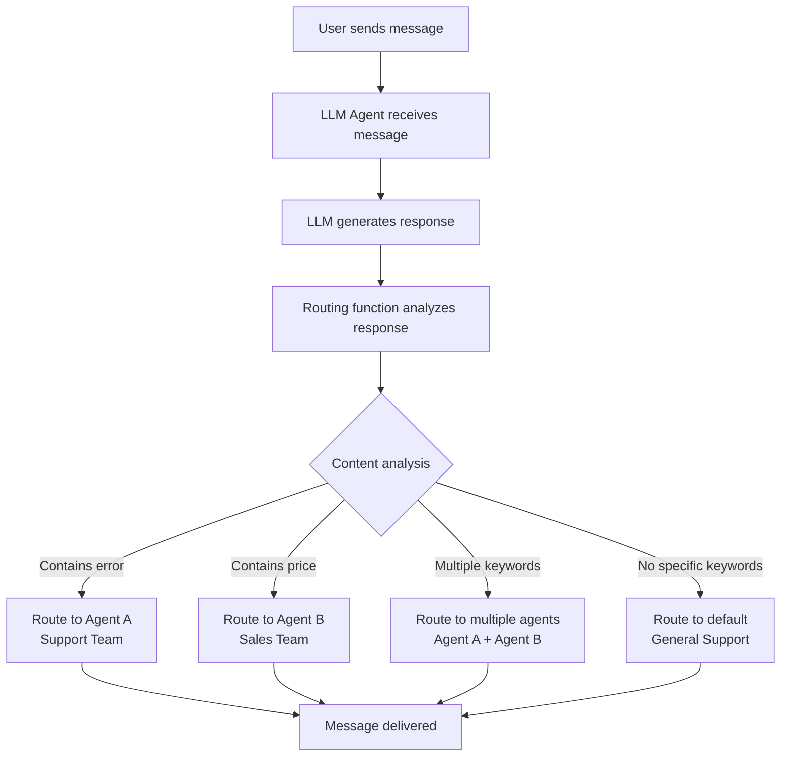

# Message Routing

Route LLM responses to different recipients based on content, context, or custom logic.

## Routing Flow



## Overview

Message routing enables you to automatically direct LLM responses to appropriate recipients:

- **Technical issues** → Support team

- **Sales inquiries** → Sales team  

- **General questions** → General support

- Send to **multiple recipients** or **transform messages** before sending

## Basic Routing

### Simple Routing Function

```python
from spade_llm import LLMAgent

def simple_router(msg, response, context):
    """Route based on response content."""
    if "error" in response.lower():
        return "support@example.com"
    elif "price" in response.lower():
        return "sales@example.com"
    else:
        return "general@example.com"

# Use with agent
agent = LLMAgent(
    jid="router@example.com",
    password="password",
    provider=provider,
    routing_function=simple_router
)
```

### Function Signature

```python
def routing_function(msg, response, context):
    """
    Args:
        msg: Original SPADE message
        response: LLM response text  
        context: Conversation context dict
    
    Returns:
        str: Single recipient JID
        List[str]: Multiple recipients
        RoutingResponse: Advanced routing
        None: Send to original sender
    """
    return "recipient@example.com"
```

## Advanced Routing

### Multiple Recipients

Send to several agents simultaneously:

```python
def multi_router(msg, response, context):
    """Route to multiple recipients."""
    recipients = ["primary@example.com"]
    
    # Copy errors to support
    if "error" in response.lower():
        recipients.append("support@example.com")
    
    # Copy sales inquiries to sales team
    if "price" in response.lower():
        recipients.append("sales@example.com")
    
    return recipients
```

### RoutingResponse

For advanced routing with message transformation:

```python
from spade_llm.routing import RoutingResponse

def advanced_router(msg, response, context):
    """Advanced routing with transformations."""
    
    def add_signature(text):
        return f"{text}\n\n--\nProcessed by AI Assistant"
    
    return RoutingResponse(
        recipients="customer@example.com",
        transform=add_signature,
        metadata={"processed_by": "my_agent"}
    )
```

## Common Patterns

### Content-Based Routing

```python
def content_router(msg, response, context):
    """Route based on keywords in response."""
    text = response.lower()
    
    # Technical issues
    if any(word in text for word in ["error", "bug", "crash", "problem"]):
        return "tech-support@example.com"
    
    # Sales inquiries
    if any(word in text for word in ["price", "cost", "buy", "purchase"]):
        return "sales@example.com"
    
    # Billing questions
    if any(word in text for word in ["payment", "invoice", "billing"]):
        return "billing@example.com"
    
    return "general@example.com"  # Default
```

### Sender-Based Routing

```python
def sender_router(msg, response, context):
    """Route based on message sender."""
    sender = str(msg.sender)
    
    # VIP users get priority support
    vip_users = ["ceo@company.com", "admin@company.com"]
    if sender in vip_users:
        return "vip-support@example.com"
    
    # Internal vs external users
    if sender.endswith("@company.com"):
        return "internal@example.com"
    else:
        return "external@example.com"
```

### Context-Aware Routing

```python
def context_router(msg, response, context):
    """Route based on conversation history."""
    state = context.get("state", {})
    interaction_count = state.get("interaction_count", 0)
    
    # Long conversations need escalation
    if interaction_count > 5:
        return RoutingResponse(
            recipients="escalation@example.com",
            metadata={"reason": "long_conversation"}
        )
    
    # New conversations to onboarding
    if interaction_count <= 1:
        return "onboarding@example.com"
    
    return "standard@example.com"
```


## Workflow Routing

### Sequential Processing

```python
def workflow_router(msg, response, context):
    """Route through workflow steps."""
    
    if "analysis complete" in response.lower():
        return "review@example.com"
    elif "review approved" in response.lower():
        return "execution@example.com"
    elif "execution finished" in response.lower():
        return "completion@example.com"
    else:
        return "analysis@example.com"  # Start workflow
```


## Quick Tips

- **Keep logic simple**: Complex routing is hard to debug
- **Always have a default**: Don't leave messages unrouted
- **Return `None`**: Sends back to original sender (useful for direct conversations)
- **Use metadata**: Add context for debugging and tracking

```python
def router_with_fallback(msg, response, context):
    # Your routing logic here...
    
    # If no specific rule matches, return to sender
    return None  # Sends back to original sender
```

## Next Steps

- **[Architecture](architecture.md)** - Understanding message flow
- **[Providers](providers.md)** - LLM provider configuration
- **[Tools System](tools-system.md)** - Adding tool capabilities
