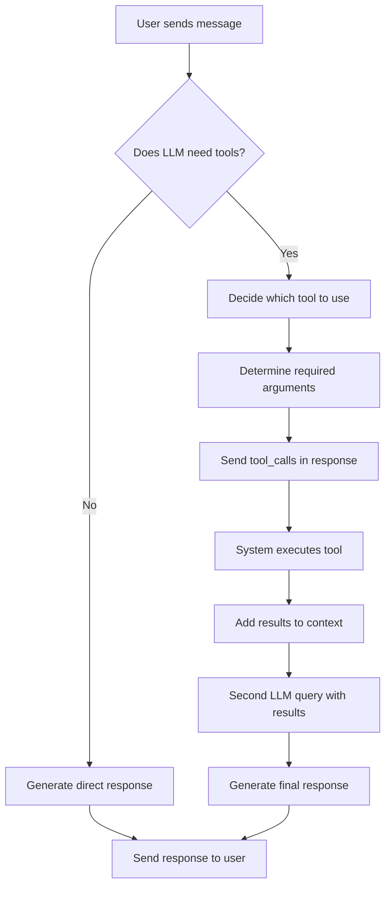

# Tools System

Enable LLM agents to **execute functions** and **interact with external services**.

## Tool Calling Flow



## Overview

The **Tools System** empowers LLM agents to _extend beyond conversation_ by executing real functions. This enables agents to:

- **🔧 Execute Python functions** with dynamic parameters
- **🌐 Access external APIs** and databases  
- **📁 Process files** and perform calculations
- **🔗 Integrate with third-party services**

## How Tool Calling Works

When an LLM agent receives a message, it can either respond directly or **decide to use tools**. The process involves:

1. **_Intelligence Decision_**: The LLM analyzes if it needs external data or functionality
2. **_Tool Selection_**: It chooses the appropriate tool from available options
3. **_Parameter Generation_**: The LLM determines what arguments the tool needs
4. **_Execution_**: The system runs the tool function asynchronously
5. **_Context Integration_**: Results are added back to the conversation
6. **_Final Response_**: The LLM processes results and provides a complete answer

## Basic Tool Definition

```python
from spade_llm import LLMTool

async def get_weather(city: str) -> str:
    """Get weather for a city."""
    return f"Weather in {city}: 22°C, sunny"

weather_tool = LLMTool(
    name="get_weather",
    description="Get current weather for a city",
    parameters={
        "type": "object",
        "properties": {
            "city": {"type": "string", "description": "City name"}
        },
        "required": ["city"]
    },
    func=get_weather
)
```

## Using Tools with Agents

```python
from spade_llm import LLMAgent, LLMProvider

agent = LLMAgent(
    jid="assistant@example.com",
    password="password",
    provider=provider,
    tools=[weather_tool]  # Register tools
)
```

When the LLM needs weather information, it will **automatically detect the need** and call the tool.

## Common Tool Categories

### **🌐 API Integration**
Connect to external web services for real-time data.

```python
import aiohttp

async def web_search(query: str) -> str:
    """Search the web for information."""
    async with aiohttp.ClientSession() as session:
        async with session.get(f"https://api.duckduckgo.com/?q={query}&format=json") as response:
            data = await response.json()
            return str(data)

search_tool = LLLTool(
    name="web_search",
    description="Search the web for current information",
    parameters={
        "type": "object",
        "properties": {
            "query": {"type": "string"}
        },
        "required": ["query"]
    },
    func=web_search
)
```

### **📁 File Operations**
Read, write, and process files on the system.

```python
import aiofiles

async def read_file(filepath: str) -> str:
    """Read a text file."""
    try:
        async with aiofiles.open(filepath, 'r') as f:
            content = await f.read()
        return f"File content:\n{content}"
    except Exception as e:
        return f"Error reading file: {e}"

file_tool = LLMTool(
    name="read_file",
    description="Read contents of a text file",
    parameters={
        "type": "object",
        "properties": {
            "filepath": {"type": "string"}
        },
        "required": ["filepath"]
    },
    func=read_file
)
```

### **📊 Data Processing**
Perform calculations and data analysis.

```python
import json

async def calculate_stats(numbers: list) -> str:
    """Calculate statistics for a list of numbers."""
    if not numbers:
        return "Error: No numbers provided"
    
    stats = {
        "count": len(numbers),
        "mean": sum(numbers) / len(numbers),
        "min": min(numbers),
        "max": max(numbers)
    }
    return json.dumps(stats, indent=2)

stats_tool = LLMTool(
    name="calculate_stats",
    description="Calculate basic statistics",
    parameters={
        "type": "object",
        "properties": {
            "numbers": {
                "type": "array",
                "items": {"type": "number"}
            }
        },
        "required": ["numbers"]
    },
    func=calculate_stats
)
```

## **LangChain Integration**

_Seamlessly use existing LangChain tools_ with SPADE_LLM:

```python
from langchain_community.tools import DuckDuckGoSearchRun
from spade_llm.tools import LangChainToolAdapter

# Create LangChain tool
search_lc = DuckDuckGoSearchRun()

# Adapt for SPADE_LLM  
search_tool = LangChainToolAdapter(search_lc)

# Use with agent
agent = LLMAgent(
    jid="assistant@example.com",
    password="password", 
    provider=provider,
    tools=[search_tool]
)
```


## **✅ Best Practices**

- **_Single Purpose_**: Each tool should do **one thing well**
- **_Clear Naming_**: Use **descriptive tool names** that explain functionality
- **_Rich Descriptions_**: Help the LLM understand **when and how** to use tools
- **_Input Validation_**: Always **validate and sanitize** inputs for security
- **_Meaningful Errors_**: Return **clear error messages** for troubleshooting
- **_Async Functions_**: Use **async/await** for non-blocking execution


## Next Steps

- **[MCP Integration](mcp.md)** - Connect to external MCP servers
- **[Architecture](architecture.md)** - Understanding system design
- **[Providers](providers.md)** - LLM provider configuration
