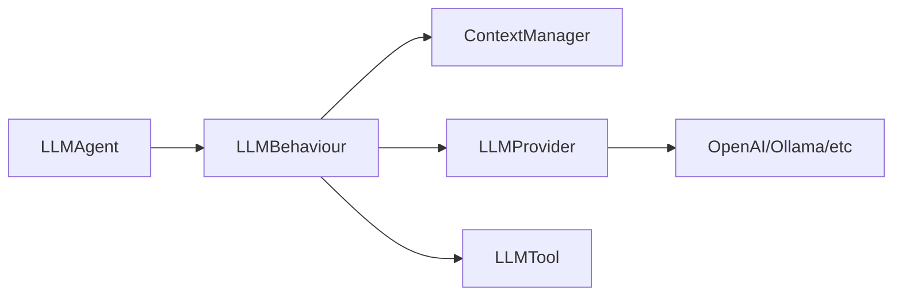

# SPADE_LLM

Extension for [SPADE](https://github.com/javipalanca/spade) that integrates Large Language Models into multi-agent systems.

## Features

- **Multi-Provider Support**: OpenAI, Ollama, LM Studio, vLLM
- **Tool System**: Function calling with async execution
- **Context Management**: Multi-conversation support with automatic cleanup
- **Message Routing**: Conditional routing based on LLM responses
- **MCP Integration**: Model Context Protocol server support
- **Production Ready**: Comprehensive error handling and logging

## Quick Start

```python
import spade
from spade_llm import LLMAgent, LLMProvider

async def main():
    provider = LLMProvider.create_openai(
        api_key="your-api-key",
        model="gpt-4o-mini"
    )
    
    agent = LLMAgent(
        jid="assistant@example.com",
        password="password",
        provider=provider,
        system_prompt="You are a helpful assistant"
    )
    
    await agent.start()

if __name__ == "__main__":
    spade.run(main())
```

## Architecture



## Documentation

- **[Installation](getting-started/installation.md)** - Setup and requirements
- **[Quick Start](getting-started/quickstart.md)** - Basic usage examples
- **[Providers](guides/providers.md)** - LLM provider configuration
- **[Tools](guides/tools-system.md)** - Tool system usage
- **[API Reference](reference/)** - Complete API documentation

## Examples

See the [examples](https://github.com/sosanzma/spade_llm/tree/main/examples) directory for complete working examples including chat agents, tool usage, and multi-agent systems.
