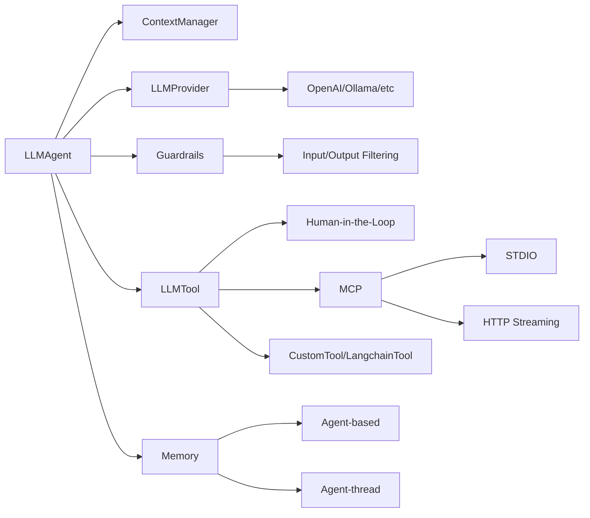

<div class="hero-section">
  <h1 class="hero-title">SPADE-LLM</h1>
  <p class="hero-subtitle">
    Build distributed based-XMPP multi-agent systems powered by Large Language Models. Extends SPADE multi-agent platform with many LLM providers for distributed AI applications, intelligent chatbots, and collaborative agent systems.
  </p>
  <div class="hero-buttons">
    <a href="getting-started/quickstart/" class="hero-button">
      🚀 Quick Start
    </a>
    <a href="getting-started/installation/" class="hero-button">
      📦 Installation
    </a>
    <a href="https://github.com/sosanzma/spade_llm" class="hero-button" target="_blank">
      📂 GitHub
    </a>
  </div>
</div>

<script type="application/ld+json">
{
  "@context": "https://schema.org",
  "@type": "SoftwareApplication",
  "name": "SPADE-LLM",
  "description": "Python framework for Large Language Model integration in multi-agent systems",
  "url": "https://sosanzma.github.io/spade_llm/",
  "applicationCategory": "DeveloperApplication",
  "operatingSystem": "Cross-platform",
  "programmingLanguage": "Python",
  "license": "https://opensource.org/licenses/MIT",
  "downloadUrl": "https://pypi.org/project/spade-llm/",
  "codeRepository": "https://github.com/sosanzma/spade_llm",
  "author": {
    "@type": "Person",
    "name": "Manel Soler Sanz"
  },
  "keywords": ["SPADE", "LLM", "multi-agent", "OpenAI", "GPT", "Ollama", "AI", "chatbot", "Python"],
  "softwareVersion": "latest",
  "requirements": "Python 3.10+",
  "featureList": [
    "Multi-LLM Provider Support",
    "Advanced Tool System", 
    "Context Management",
    "Memory Extensions",
    "Message Routing",
    "Content Safety Guardrails",
    "MCP Integration",
    "Human-in-the-Loop"
  ]
}
</script>

## Key Features

<div class="stats-grid">
  <div class="stat-card">
    <span class="stat-number">8+</span>
    <div class="stat-label">LLM Providers</div>
  </div>
  <div class="stat-card">
    <span class="stat-number">100%</span>
    <div class="stat-label">Python Native</div>
  </div>
  <div class="stat-card">
    <span class="stat-number">0</span>
    <div class="stat-label">External Dependencies</div>
  </div>
  <div class="stat-card">
    <span class="stat-number">∞</span>
    <div class="stat-label">Agent Scalability</div>
  </div>
</div>

<div class="feature-grid">
  <div class="feature-card">
    <div class="feature-icon">🔧</div>
    <h3>Built-in XMPP Server</h3>
    <p>No external server setup required with SPADE 4.0+. Get started instantly with zero configuration.</p>
  </div>
  
  <div class="feature-card">
    <div class="feature-icon">🧠</div>
    <h3>Multi-Provider Support</h3>
    <p>OpenAI GPT, Ollama, LM Studio, vLLM, Anthropic Claude and more. Switch providers seamlessly.</p>
  </div>
  
  <div class="feature-card">
    <div class="feature-icon">⚡</div>
    <h3>Advanced Tool System</h3>
    <p>Function calling with async execution, human-in-the-loop workflows, and LangChain integration.</p>
  </div>
  
  <div class="feature-card">
    <div class="feature-icon">💾</div>
    <h3>Dual Memory Architecture</h3>
    <p>Agent learning and conversation continuity with SQLite persistence and contextual retrieval.</p>
  </div>
  
  <div class="feature-card">
    <div class="feature-icon">🎯</div>
    <h3>Context Management</h3>
    <p>Multi-conversation support with automatic cleanup and intelligent context window management.</p>
  </div>
  
  <div class="feature-card">
    <div class="feature-icon">🛡️</div>
    <h3>Guardrails System</h3>
    <p>Content filtering and safety controls for input/output with customizable rules and policies.</p>
  </div>
  
  <div class="feature-card">
    <div class="feature-icon">🔗</div>
    <h3>Message Routing</h3>
    <p>Conditional routing based on LLM responses with flexible workflows and decision trees.</p>
  </div>
  
  <div class="feature-card">
    <div class="feature-icon">🌐</div>
    <h3>MCP Integration</h3>
    <p>Model Context Protocol server support for external tool integration and service connectivity.</p>
  </div>
</div>

## Architecture Overview

<div class="architecture-diagram">



</div>

## Quick Start

<div class="code-example">
  <div class="code-example-header">
    🐍 Basic Agent Setup
  </div>

```python
import spade
from spade_llm import LLMAgent, LLMProvider

async def main():
    # First, start SPADE's built-in server:
    # spade run
    
    provider = LLMProvider.create_openai(
        api_key="your-api-key",
        model="gpt-4o-mini"
    )
    
    agent = LLMAgent(
        jid="assistant@localhost",
        password="password",
        provider=provider,
        system_prompt="You are a helpful assistant"
    )
    
    await agent.start()

if __name__ == "__main__":
    spade.run(main())
```

</div>

<div style="text-align: center; margin: 2rem 0;">
  <span class="badge badge--success">Python 3.10+</span>
  <span class="badge badge--info">MIT License</span>
  <span class="badge badge--warning">Beta Release</span>
</div>

## Documentation Structure

### Getting Started
- **[Installation](getting-started/installation.md)** - Setup and requirements
- **[Quick Start](getting-started/quickstart.md)** - Basic usage examples

### Core Guides
- **[Architecture](guides/architecture.md)** - SPADE_LLM general structure
- **[Providers](guides/providers.md)** - LLM provider configuration
- **[Tools System](guides/tools-system.md)** - Function calling capabilities
- **[Memory System](guides/memory.md)** - Agent learning and conversation continuity
- **[Context Management](guides/context-management.md)** - Context control and message management
- **[Conversations](guides/conversations.md)** - Conversation lifecycle and management
- **[Guardrails](guides/guardrails.md)** - Content filtering and safety controls
- **[Message Routing](guides/routing.md)** - Conditional message routing


### Reference
- **[API Reference](reference/)** - Complete API documentation
- **[Examples](reference/examples.md)** - Working code examples

## Examples

Explore the [examples directory](https://github.com/sosanzma/spade_llm/tree/main/examples) for complete working examples:

- **`multi_provider_chat_example.py`** - Chat with different LLM providers
- **`ollama_with_tools_example.py`** - Local models with tool calling
- **`guardrails_example.py`** - Content filtering and safety controls
- **`langchain_tools_example.py`** - LangChain tool integration
- **`valencia_multiagent_trip_planner.py`** - Multi-agent workflow


