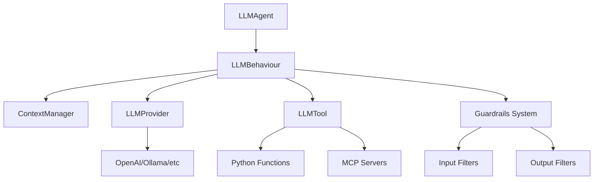

# SPADE_LLM : SPADE with Large Language Models 

Extension for [SPADE](https://github.com/javipalanca/spade) that integrates Large Language Models into multi-agent systems.

## Features

- **Multi-Provider Support**: OpenAI, Ollama, LM Studio, vLLM
- **Tool System**: Function calling with async execution
- **Context Management**: Multi-conversation support with automatic cleanup
- **Message Routing**: Conditional routing based on LLM responses
- **Guardrails System**: Content filtering and safety controls for input/output
- **MCP Integration**: Model Context Protocol server support
- **Production Ready**: Comprehensive error handling and logging

## Quick Start

```python
import spade
from spade_llm import LLMAgent, LLMProvider

async def main():
    provider = LLMProvider.create_openai(
        api_key="your-api-key",
        model="gpt-4o-mini"
    )
    
    agent = LLMAgent(
        jid="assistant@example.com",
        password="password",
        provider=provider,
        system_prompt="You are a helpful assistant"
    )
    
    await agent.start()

if __name__ == "__main__":
    spade.run(main())
```

## Architecture



## Documentation Structure

### Getting Started
- **[Installation](getting-started/installation.md)** - Setup and requirements
- **[Quick Start](getting-started/quickstart.md)** - Basic usage examples

### Core Guides
- **[Architecture](guides/architecture.md)** - SPADE_LLM general structure
- **[Providers](guides/providers.md)** - LLM provider configuration
- **[Tools System](guides/tools-system.md)** - Function calling capabilities
- **[Guardrails](guides/guardrails.md)** - Content filtering and safety controls
- **[Message Routing](guides/routing.md)** - Conditional message routing
- **[Context Management](guides/conversations.md)** - Conversation handling


### Reference
- **[API Reference](reference/)** - Complete API documentation
- **[Examples](reference/examples.md)** - Working code examples

## Examples

Explore the [examples directory](https://github.com/sosanzma/spade_llm/tree/main/examples) for complete working examples:

- **`multi_provider_chat_example.py`** - Chat with different LLM providers
- **`ollama_with_tools_example.py`** - Local models with tool calling
- **`guardrails_example.py`** - Content filtering and safety controls
- **`langchain_tools_example.py`** - LangChain tool integration
- **`valencia_multiagent_trip_planner.py`** - Multi-agent workflow


