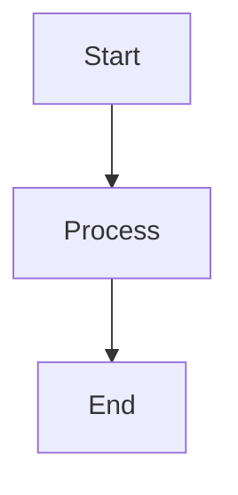

# SPADE_LLM Documentation

This directory contains the source files for the SPADE_LLM documentation, built with [MkDocs](https://www.mkdocs.org/) and the [Material theme](https://squidfunk.github.io/mkdocs-material/).

## 📖 Documentation Structure

```
docs/
├── mkdocs.yml              # MkDocs configuration
├── requirements.txt        # Documentation dependencies
├── docs/                   # Documentation source files
│   ├── index.md           # Homepage
│   ├── getting-started/   # Getting Started guides
│   ├── guides/            # User guides
│   ├── tutorials/         # Step-by-step tutorials
│   ├── reference/         # API reference
│   ├── cookbook/          # Code recipes
│   ├── contributing/      # Contribution guides
│   ├── stylesheets/       # Custom CSS
│   ├── javascripts/       # Custom JavaScript
│   └── includes/          # Reusable snippets
└── site/                  # Generated documentation (ignored by git)
```

## 🚀 Local Development

### Prerequisites

- Python 3.10+
- pip or poetry

### Setup

1. **Install dependencies:**
   ```bash
   cd docs
   pip install -r requirements.txt
   ```

2. **Start development server:**
   ```bash
   mkdocs serve
   ```

3. **Open browser:**
   Navigate to `http://localhost:8000`

The server will automatically reload when you make changes to the documentation files.

### Building for Production

```bash
# Build static site
mkdocs build

# Serve built site locally
mkdocs serve --dev-addr localhost:8001
```

The built site will be in the `site/` directory.

## ✍️ Writing Documentation

### Markdown Features

We use [Python-Markdown](https://python-markdown.github.io/) with several extensions:

#### Admonitions
```markdown
!!! note "Title"
    This is a note with a custom title.

!!! warning
    This is a warning without a custom title.

!!! tip "Pro Tip"
    This is a helpful tip for users.
```

#### Code Blocks
```markdown
```python
# Python code with syntax highlighting
async def example():
    return "Hello, World!"
```

```bash
# Bash commands
pip install spade_llm
```
```

#### Tabs
```markdown
=== "OpenAI"
    ```python
    provider = LLMProvider.create_openai(api_key="key")
    ```

=== "Ollama"
    ```python
    provider = LLMProvider.create_ollama(model="llama3")
    ```
```

#### Mermaid Diagrams
```markdown

```

### Style Guide

#### Headers
- Use sentence case (not title case)
- Use descriptive headers that explain what users will learn
- Follow logical hierarchy (H1 → H2 → H3)

#### Code Examples
- Always include complete, runnable examples
- Add comments to explain non-obvious parts
- Test all examples before publishing
- Use realistic variable names and values

#### Links
- Use descriptive link text (not "click here")
- Link to relevant sections within the documentation
- Keep external links up to date

#### Writing Style
- Write in second person ("you can...")
- Be concise and clear
- Use active voice
- Include practical examples
- Explain the "why" not just the "how"

### Page Templates

#### API Reference Template
```markdown
# Class Name

Brief description of what this class does.

## Constructor

```python
class_name(param1: type, param2: type = default)
```

**Parameters:**
- `param1` (type): Description of parameter
- `param2` (type, optional): Description with default value

## Methods

### method_name()

```python
async def method_name(param: type) -> return_type:
```

Description of what the method does.

**Parameters:**
- `param` (type): Parameter description

**Returns:**
- `return_type`: Description of return value

**Example:**
```python
# Working example
```
```

#### Tutorial Template
```markdown
# Tutorial Title

Brief description of what users will build/learn.

## Prerequisites

- Requirement 1
- Requirement 2

## What You'll Build

Description of the end result.

## Step 1: Setup

Instructions...

## Step 2: Implementation

Instructions...

## Complete Code

Full working example.

## Next Steps

Links to related content.
```

## 🔧 Configuration

### MkDocs Configuration (`mkdocs.yml`)

Key configuration sections:

- **Theme**: Material theme with custom colors and features
- **Plugins**: Search, API documentation generation, autorefs
- **Extensions**: Enhanced Markdown features
- **Navigation**: Site structure and page organization

### Custom Styling (`docs/stylesheets/extra.css`)

Custom CSS for:
- Code block improvements
- Feature grid layouts
- Responsive design adjustments
- Brand-specific styling

### JavaScript (`docs/javascripts/`)

- **MathJax**: Mathematical notation support
- **Custom scripts**: Enhanced functionality

## 📝 Content Guidelines

### API Documentation

- Auto-generated from docstrings using `mkdocstrings`
- Keep docstrings up to date in source code
- Include examples in docstrings when helpful
- Follow Google-style docstring format

### Examples

- Test all examples before publishing
- Use realistic scenarios
- Include error handling where appropriate
- Keep examples focused and concise

### Cross-References

- Link between related documentation sections
- Use relative links for internal content
- Keep link targets up to date when restructuring

## 🚀 Deployment

### Automatic Deployment

Documentation is automatically built and deployed via GitHub Actions:

- **Trigger**: Push to `main` branch or changes to docs/
- **Build**: MkDocs generates static site
- **Deploy**: GitHub Pages hosts the site

### Manual Deployment

```bash
# Deploy to GitHub Pages
mkdocs gh-deploy
```

### Environment Variables

For building documentation that includes API keys or sensitive data, use environment variables:

```bash
export DOC_API_KEY="your-key-here"
mkdocs build
```

## 🐛 Troubleshooting

### Common Issues

#### Build Errors
- Check that all referenced files exist
- Verify Markdown syntax is correct
- Ensure Python imports work for API docs

#### Navigation Issues
- Check `mkdocs.yml` navigation structure
- Verify file paths are correct
- Ensure index files exist for directories

#### Styling Problems
- Check CSS syntax in custom stylesheets
- Verify theme configuration
- Test responsive design on different screen sizes

### Getting Help

- Check MkDocs documentation: https://www.mkdocs.org/
- Material theme docs: https://squidfunk.github.io/mkdocs-material/
- Open an issue in the main repository

## 🤝 Contributing

### Documentation Contributions

1. **Fork** the repository
2. **Create** a branch for your changes
3. **Make** your improvements
4. **Test** locally with `mkdocs serve`
5. **Submit** a pull request

### Content Improvements

We welcome:
- Typo fixes and grammar improvements
- New examples and tutorials
- Better explanations of complex concepts
- Translation to other languages
- Improved navigation and organization

### Technical Improvements

- Custom CSS/JavaScript enhancements
- Plugin integrations
- Build process improvements
- Accessibility improvements

---

Thank you for helping improve SPADE_LLM documentation! 📚
