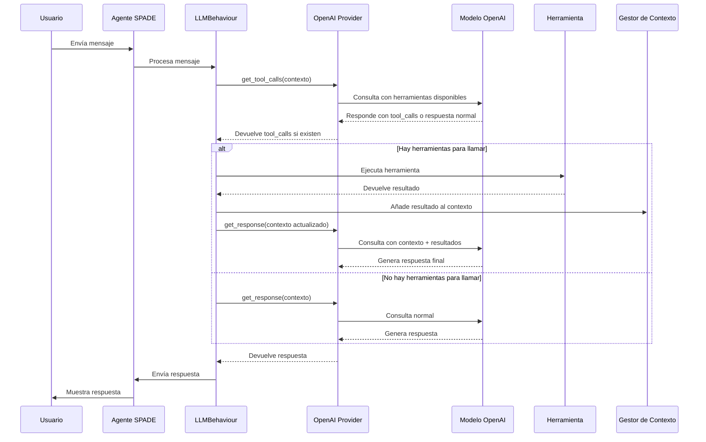
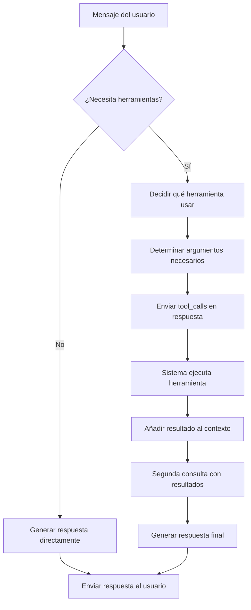

# Entendiendo el Tool Calling en SPADE_LLM: Un Análisis Detallado

## 1. Introducción

El tool calling (llamada a herramientas) es un mecanismo que permite a los Modelos de Lenguaje Extenso (LLMs) interactuar con herramientas externas para realizar tareas específicas que van más allá de su conocimiento o capacidades. Este documento explica cómo funciona este proceso en SPADE_LLM.

## 2. Arquitectura y Flujo General



## 3. Ejemplo Detallado: Consulta a Wikipedia

Veamos un ejemplo paso a paso de cómo el sistema procesa la consulta: **"¿Quién fue Julio Iglesias según Wikipedia?"**

### 3.1 Preparación de Herramientas Disponibles

Cuando el LLMBehaviour se inicializa, registra las herramientas disponibles:

```python
tools = [tool.to_openai_tool() for tool in self.tools]
```

Esto produce una lista de definiciones de herramientas en formato compatible con OpenAI:

```json
[
  {
    "type": "function",
    "function": {
      "name": "calculator",
      "description": "Perform simple arithmetic calculations",
      "parameters": {
        "type": "object",
        "properties": {
          "expression": {
            "type": "string",
            "description": "The arithmetic expression to calculate (e.g., '2 + 2 * 3')"
          }
        },
        "required": ["expression"]
      }
    }
  },
  {
    "type": "function",
    "function": {
      "name": "duckduckgo_search",
      "description": "Search the web for current information using DuckDuckGo. Use this tool when you need to find recent information or current events.",
      "parameters": {
        "description": "Input for the DuckDuckGo search tool.",
        "properties": {
          "query": {
            "description": "search query to look up",
            "title": "Query",
            "type": "string"
          }
        },
        "required": ["query"],
        "title": "DDGInput",
        "type": "object"
      }
    }
  },
  {
    "type": "function",
    "function": {
      "name": "wikipedia",
      "description": "Search Wikipedia for information about a specific topic. This is useful for getting detailed factual information about people, places, events, concepts, etc.",
      "parameters": {
        "description": "Input for the WikipediaQuery tool.",
        "properties": {
          "query": {
            "description": "query to look up on wikipedia",
            "title": "Query",
            "type": "string"
          }
        },
        "required": ["query"],
        "title": "WikipediaQueryInput",
        "type": "object"
      }
    }
  }
]
```

### 3.2 Solicitud Inicial al LLM

Cuando llega la consulta del usuario, el sistema realiza una primera llamada al LLM para determinar si es necesario usar alguna herramienta:

```python
response = await asyncio.to_thread(
    self.client.chat.completions.create,
    model=self.model,
    messages=prompt,
    temperature=self.temperature,
    tools=tools,
    tool_choice="auto"  # El LLM decide si usar herramientas
)
```

### 3.3 Decisión del LLM sobre Herramientas

El modelo analiza la consulta y las herramientas disponibles para decidir qué hacer. En este caso, reconoce que:
- La consulta busca información sobre "Julio Iglesias"
- Específicamente menciona "según Wikipedia"
- Hay una herramienta llamada "wikipedia" disponible

Por lo tanto, decide usar la herramienta de Wikipedia en lugar de responder directamente:

```python
# Respuesta del OpenAI API
ChatCompletionMessage(
    content=None,  # Sin contenido directo, usa herramienta instead
    role='assistant', 
    tool_calls=[
        ChatCompletionMessageToolCall(
            id='call_vTVJJqeZ7iEbNeE2RtF8nkRO', 
            function=Function(
                arguments='{"query":"Julio Iglesias"}', 
                name='wikipedia'
            ), 
            type='function'
        )
    ]
)
```

Transformado a formato de SPADE_LLM:

```json
[{
  "id": "call_vTVJJqeZ7iEbNeE2RtF8nkRO", 
  "name": "wikipedia", 
  "arguments": {
    "query": "Julio Iglesias"
  }
}]
```

### 3.4 Ejecución de la Herramienta

El sistema identifica la herramienta a ejecutar y llama a su método `execute()` con los argumentos proporcionados:

```python
# Find the tool by name
tool = next((t for t in self.provider.tools if t.name == tool_name), None)

# Execute the tool
result = await tool.execute(**tool_args)
```

En este caso, ejecuta `wikipedia.execute(query="Julio Iglesias")`, que retorna:

```
Page: Julio Iglesias
Summary: Julio José Iglesias de la Cueva (Spanish: [ˈxuljo jˈɣlesjas]; born 23 September 1943) is a Spanish singer, songwriter and former professional footballer. Iglesias is recognized as the most commercially successful Spanish singer in the world and one of the top record sellers in music history, having sold more than 300 million records worldwide in 14 languages. It is estimated that during his career he has performed in more than 5,000 concerts, for over 60 million people in five continents...
```

### 3.5 Actualización del Contexto de Conversación

El resultado de la herramienta se añade al contexto de la conversación:

```python
self.context.add_tool_result(tool_name, result, conversation_id)
```

Esto genera una entrada en el contexto con el rol "function":

```python
{
    'role': 'function', 
    'content': 'Page: Julio Iglesias\nSummary: Julio José Iglesias de la Cueva...',
    'name': 'wikipedia'
}
```

### 3.6 Solicitud Final al LLM

Con el contexto actualizado que ahora incluye el resultado de la herramienta, se realiza una segunda llamada al LLM:

```python
response = await self.provider.get_response(self.context)
```

El prompt enviado al LLM incluye:
1. La consulta original del usuario
2. El resultado de la herramienta Wikipedia

```python
[
    {'role': 'user', 'content': 'quien fue julio iglesias segun wikipedia? '}, 
    {
        'role': 'function', 
        'content': 'Page: Julio Iglesias\nSummary: Julio José Iglesias de la Cueva...',
        'name': 'wikipedia'
    }
]
```

### 3.7 Respuesta Final

El LLM ahora genera una respuesta basada en la información obtenida:

```
Julio Iglesias, cuyo nombre completo es Julio José Iglesias de la Cueva, nació el 23 de septiembre de 1943. Es un cantante, compositor y exfutbolista español, ampliamente reconocido como el cantante español más exitoso comercialmente en el mundo y uno de los más grandes vendedores de discos en la historia de la música, con más de 300 millones de discos vendidos en 14 idiomas...
```

Esta respuesta se envía de vuelta al usuario a través del agente SPADE.

## 4. El Proceso de Selección de Herramientas



### Factores que influyen en la decisión:

1. **Palabras clave en la consulta**: La mención de "Wikipedia" es una señal clara.
2. **Naturaleza de la pregunta**: Una pregunta de información sobre una persona.
3. **Descripción de herramientas**: La herramienta Wikipedia menciona "información sobre personas".
4. **Contexto previo**: La historia de la conversación.

## 5. Implementación Técnica Clave

### Definición de herramientas (formato OpenAI)

```python
{
  "type": "function",
  "function": {
    "name": string,       # Nombre único de la herramienta
    "description": string, # Descripción clara que ayuda al modelo a decidir
    "parameters": object   # Esquema JSON de los parámetros esperados
  }
}
```

### Recepción de tool_calls

```python
if hasattr(message, 'tool_calls') and message.tool_calls:
    tool_calls = []
    for tc in message.tool_calls:
        try:
            args = json.loads(tc.function.arguments)
        except json.JSONDecodeError:
            logger.error(f"Failed to parse tool arguments: {tc.function.arguments}")
            args = {"error": "Invalid JSON"}
        
        tool_calls.append({
            "id": tc.id,
            "name": tc.function.name,
            "arguments": args
        })
    return tool_calls
```

### Ejecución de herramienta y actualización de contexto

```python
# Execute the tool
result = await tool.execute(**tool_args)

# Add the result to the context
self.context.add_tool_result(tool_name, result, conversation_id)
```
